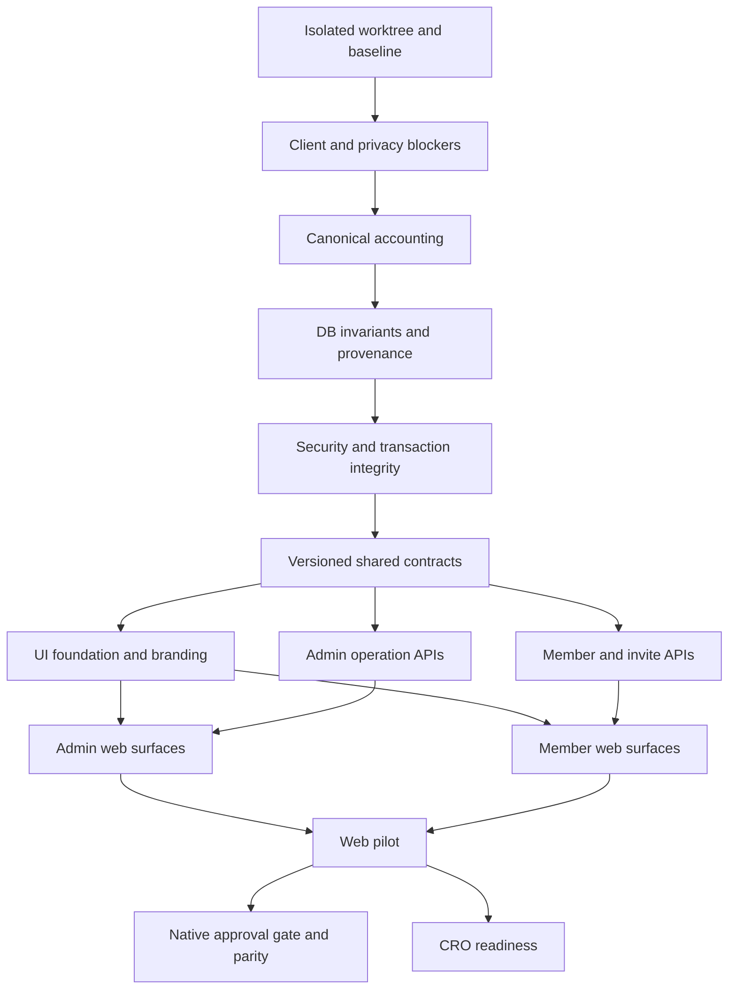

# Network Ledger Implementation Plan

> **For agentic workers:** REQUIRED SUB-SKILL: Use superpowers:subagent-driven-development (recommended) or superpowers:executing-plans to implement this plan task-by-task. Steps use checkbox (`- [ ]`) syntax for tracking.

**Goal:** Deliver the Network Ledger experience so tenant administrators can explain, reserve, settle, and prove every commission payout safely, then expose the same proof chain to members and the invite funnel.

**Architecture:** Keep PostgreSQL and the existing commission engine as the financial source of truth. Add expand-first invariants and approval-time provenance, project versioned view models through NestJS, and consume those contracts in focused Next.js and Expo surfaces. Ship as independently testable vertical slices; use tenant-scoped capability controls only when they already exist or are separately authorized. Never infer historical money from current state.

**Tech Stack:** Node.js >=22, pnpm 10.29.2, TypeScript, NestJS 11, Prisma 6, PostgreSQL, Jest 29, Next.js 15, React 19, Tailwind CSS 4, shadcn/Radix, Expo 52, React Native 0.76.

## Global Constraints

- Do not add a package or change `package.json`, `pnpm-lock.yaml`, or another lockfile without explicit approval.
- Do not change `.env`, production configuration, secrets, billing, or deployment configuration without explicit approval.
- `MFA_SECRET_ENCRYPTION_KEY` must be an approved production secret before encrypted TOTP writes or backfill are enabled.
- Native production rollout is blocked until secure-storage dependency and lockfile changes are explicitly approved.
- Runtime copy remains English-only and every new web/mobile string is routed through the existing i18n dictionaries.
- Store money as PostgreSQL `BigInt`; expose cents as base-10 strings; never use JavaScript `Number` for financial arithmetic.
- Resolve tenant and membership from authenticated server context; never trust a client-supplied tenant identifier.
- A missing approval-time plan remains `legacy`; never reconstruct historical plan name, pool, or retained amount from the current plan.
- Member projections never expose another member, downline, customer reference, recipient snapshot, or settlement evidence.
- Financial mutations are pessimistic: no optimistic `paid`, `settled`, or balance state.
- Financial mutation and its audit record commit in the same transaction.
- Migrations are additive and expand-first; no destructive rollback or financial-row deletion.
- Logs and metrics contain no request body, token, email, customer reference, evidence text, or unbounded tenant label.
- Interaction analytics and a `ProductEvent` schema remain outside the default execution path until privacy, retention, and migration approval exists.
- Reuse current dependencies and scripts; do not add animation, chart, analytics, or test packages.
- Preserve all pre-existing working-tree changes. Start implementation in an isolated `codex/` worktree via `superpowers:using-git-worktrees`.
- Each code-changing task begins with a failing regression test, ends with targeted verification, and stages only its exact files. Operational tasks M08/M13 produce signed external evidence and no source commit by default.

---

## Approved Source of Truth

- Product and design decisions: `docs/superpowers/specs/2026-07-14-network-ledger-premium-redesign-design.md`
- This file: delivery order, stable interfaces, gates, checkpoints, and completion policy.
- Detailed packet 1: `docs/superpowers/plans/2026-07-14-network-ledger-01-correctness-foundation.md`
- Detailed packet 2: `docs/superpowers/plans/2026-07-14-network-ledger-02-admin-operations.md`
- Detailed packet 3: `docs/superpowers/plans/2026-07-14-network-ledger-03-member-growth-rollout.md`
- Execution tracker: `tasks/network-ledger-todo.md`

The existing untracked `tasks/plan.md` and `tasks/todo.md` are user-owned and must remain untouched.

## Skill Routing During Execution

Skills constrain how a task is reviewed; they never widen scope, authorize a dependency, or bypass G1-G7.

| Stage | Skills | Required effect |
|---|---|---|
| Discovery already completed | `find-skills`, `improve`, `customer-research` | Use source/test evidence to expose capability and customer-trust gaps; do not install a package merely because a skill exists. |
| Approved concept/spec | `brainstorming`, `idea-refine`, `spec-driven-development`, `planning-and-task-breakdown` | Keep Network Ledger as the approved concept, preserve the written contracts, and execute only the ordered task packets. Do not reopen visual direction during implementation. |
| Admin/member UI | `frontend-design`, `shadcn-ui`, `make-interfaces-feel-better`, `web-design-guidelines`, `tailwind-design-system`, `vercel-composition-patterns` | Enforce the restrained ledger aesthetic, semantic tokens, existing shadcn/Radix primitives, responsive composition, accessible interaction, and bounded component APIs in A02-A15/M02-M05. |
| Trust and growth | `product-marketing`, `customer-research`, `marketing-ideas`, `cro` | Review invite/benefit copy against real product truth. Keep claims non-financial and evidence-led. `marketing-ideas`/`cro` may propose an experiment only after G5 and M13; they cannot add analytics beforehand. |
| Quality | `code-review-and-quality`, `verification-before-completion` | Review each packet across correctness, security, performance, UI states, accessibility, and maintainability; require fresh command evidence before completion claims. |
| Browser evidence | `webapp-testing`, `playwright-cli` | Define deterministic journeys, focus/overflow/privacy assertions, and runtime checks. Use the already available Python Playwright runtime because no repository Playwright package or CLI installation is authorized. |

If a named skill recommends work outside the task's exact files or approvals, record it as a later suggestion rather than expanding the implementation task.

## Delivery Outcomes

1. Parallel 401 responses create one refresh request per client process.
2. Public invite clients render the tenant-centered contract actually returned by the API.
3. Dashboard, analytics, wallet, payout, and reconciliation use one canonical ledger definition.
4. Commission plans are unique by `(tenantId, effectiveFrom)` and approved sales retain exact plan provenance when known.
5. TOTP secrets are encrypted at rest after the production-key gate; legacy plaintext is dual-read only during bounded migration.
6. Audit and money/permission mutations share a transaction boundary.
7. Paid payout exports use immutable reservation snapshots and fail closed for unsafe legacy rows.
8. Maturation processes bounded batches and cannot hold an unbounded transaction.
9. Admins receive Command Center, Sale Commission Lineage, Payout Workspace, server-filtered Audit, and consistent branding.
10. Members receive a paginated, privacy-safe Money Timeline and authoritative invite funnel.
11. Web pilot reaches zero reconciliation mismatch before cohort rollout; native and CRO remain approval-gated.

## Stable Shared Interfaces

A01 creates these exports after the correctness packet and before API/UI consumers begin:

```ts
export type MoneyCents = `${bigint}`;
export type LedgerStatusV1 = 'pending' | 'payable' | 'processing' | 'paid' | 'reversed';
export type LedgerTypeV1 = 'commission' | 'reversal' | 'adjustment';

export interface CanonicalCommissionTotalsV1 {
  pendingCents: MoneyCents;
  payableCents: MoneyCents;
  processingCents: MoneyCents;
  paidCents: MoneyCents;
  grossCents: MoneyCents;
  reversalCents: MoneyCents;
  adjustmentCents: MoneyCents;
  netCents: MoneyCents;
}

// Invariant within the response scope:
// gross = commission lines; reversal/adjustment retain their signed values;
// net = gross + reversal + adjustment. Status buckets sum all three types only
// while status is pending/payable/processing/paid; reversed rows are excluded.

export type AttentionKindV1 =
  | 'reconciliation_mismatch'
  | 'processing_over_sla'
  | 'payout_requested'
  | 'sale_needs_approval'
  | 'pending_over_sla';

export interface AdminOperationsSummaryV1 {
  version: 1;
  month: string;
  currency: string;
  cashFlow: CanonicalCommissionTotalsV1;
  sales: {
    draftCount: number;
    approvedCount: number;
    voidCount: number;
    approvedRevenueCents: MoneyCents;
  };
  payouts: {
    requestedCount: number;
    processingBatchCount: number;
    failedBatchCount: number;
    oldestRequestedAt: string | null;
    oldestProcessingAt: string | null;
  };
  needsAttention: Array<{
    kind: AttentionKindV1;
    count: number;
    amountCents: MoneyCents | null;
    oldestAt: string | null;
    href: string;
  }>;
}

export interface SaleCommissionLineageV1 {
  version: 1;
  sale: {
    id: string;
    amountCents: MoneyCents;
    currency: string;
    status: 'draft' | 'approved' | 'void';
    saleDate: string;
  };
  plan:
    | { provenance: 'exact'; id: string; name: string; effectiveFrom: string; poolRateBps: number; depth: number }
    | { provenance: 'legacy' };
  lines: Array<{
    id: string;
    level: number;
    type: LedgerTypeV1;
    status: LedgerStatusV1;
    rateBps: number;
    amountCents: MoneyCents;
    beneficiary: { displayName: string; referralCode: string };
    maturesAt: string | null;
    payoutId: string | null;
    payoutBatchId: string | null;
  }>;
  totals: CanonicalCommissionTotalsV1;
}

export type PayoutBatchStatusV1 = 'processing' | 'settled' | 'failed';
export type PayoutMethodV1 = 'manual' | 'csv';

export interface PayoutWorkspaceSummaryV1 {
  version: 1;
  currency: string;
  ready: { unit: 'members'; count: number; totalCents: MoneyCents };
  requested: { unit: 'requests'; count: number; totalCents: MoneyCents };
  processing: { unit: 'batches'; count: number; totalCents: MoneyCents };
  released: { unit: 'batches'; count: number; totalCents: MoneyCents };
  history: { unit: 'batches'; count: number; totalCents: MoneyCents };
}

export interface PayableMemberPageV1 {
  version: 1;
  currency: string;
  payoutMinCents: MoneyCents;
  page: number;
  pageSize: number;
  total: number;
  items: Array<{
    membershipId: string;
    referralCode: string;
    displayName: string;
    netCents: MoneyCents;
  }>;
}

export interface PayoutRequestPageV1 {
  version: 1;
  currency: string;
  page: number;
  pageSize: number;
  total: number;
  items: Array<{
    id: string;
    batchId: string | null;
    membershipId: string;
    referralCode: string;
    displayName: string;
    totalCents: MoneyCents;
    method: PayoutMethodV1;
    status: 'requested' | 'processing' | 'paid' | 'rejected' | 'failed';
    period: string;
    requestedAt: string;
    processingStartedAt: string | null;
    paidAt: string | null;
  }>;
}

export interface PayoutBatchPageV1 {
  version: 1;
  currency: string;
  page: number;
  pageSize: number;
  total: number;
  items: Array<{
    id: string;
    period: string;
    method: PayoutMethodV1;
    status: PayoutBatchStatusV1;
    payoutCount: number;
    ledgerEntryCount: number;
    totalCents: MoneyCents;
    processingStartedAt: string;
    settledAt: string | null;
    failedAt: string | null;
  }>;
}

export interface PayoutBatchDetailV1 {
  version: 1;
  currency: string;
  canViewEvidence: boolean;
  batch: {
    id: string;
    period: string;
    method: PayoutMethodV1;
    status: PayoutBatchStatusV1;
    payoutCount: number;
    ledgerEntryCount: number;
    totalCents: MoneyCents;
    processingStartedAt: string;
    settledAt: string | null;
    failedAt: string | null;
  };
  timeline: Array<{
    event: 'processing_started' | 'settled' | 'failed';
    at: string;
    actorUserId: string | null;
  }>;
  evidence: null | {
    csvChecksum: string | null;
    settlementReference: string | null;
    settlementEvidence: string | null;
    failureReason: string | null;
  };
  items: {
    page: number;
    pageSize: number;
    total: number;
    items: Array<{
      id: string;
      payoutId: string;
      ledgerEntryId: string;
      month: string;
      level: number;
      amountCents: MoneyCents;
      recipient: null | {
        referralCode: string | null;
        fullName: string | null;
        email: string | null;
        snapshotAt: string | null;
      };
    }>;
  };
}

export interface AuditPageV1 {
  version: 1;
  page: number;
  pageSize: number;
  total: number;
  items: Array<{
    id: string;
    action: string;
    entity: string;
    entityId: string | null;
    actorUserId: string | null;
    before: unknown | null;
    after: unknown | null;
    redacted: boolean;
    createdAt: string;
  }>;
  facets: {
    actions: Array<{ value: string; count: number }>;
    entities: Array<{ value: string; count: number }>;
    actors: Array<{ value: string; count: number }>;
  };
}

export interface MoneyTimelinePageV1 {
  version: 1;
  currency: string;
  totals: CanonicalCommissionTotalsV1;
  page: number;
  pageSize: number;
  total: number;
  items: MoneyTimelineItemV1[];
}

export type MoneyTimelineItemV1 = {
  id: string;
  kind: LedgerTypeV1;
  status: LedgerStatusV1;
  amountCents: MoneyCents;
  currency: string;
  level: number;
  rateBps: number;
  saleId: string;
  maturesAt: string | null;
  payoutId: string | null;
  createdAt: string;
};

export interface MoneyTimelineDetailV1 {
  version: 1;
  entry: MoneyTimelineItemV1;
  sale: { id: string; saleDate: string };
  payout: null | {
    id: string;
    status: 'requested' | 'processing' | 'paid' | 'rejected' | 'failed';
    period: string;
    requestedAt: string;
    processingStartedAt: string | null;
    paidAt: string | null;
    settledAt: string | null;
  };
}

export interface InviteFunnelSummaryV1 {
  version: 1;
  issued: number;
  active: number;
  expired: number;
  joined: number;
  emailVerified: number;
  activatedByApprovedSale: number;
}

export interface PublicBrand {
  name: string;
  monogram: string;
  tagline: string;
  primaryColor: string;
  accentColor: string;
}

export interface PublicInviteResolution {
  code: string;
  valid: boolean;
  tenantName: string;
  tenantSlug: string;
  brand: PublicBrand;
  expiresAt: string;
  emailLocked: boolean;
}

export interface SwitchTenantSession {
  accessToken: string;
  activeMembershipId: string;
}
```

The exact definitions live in `packages/shared/src/contracts/network-ledger.ts`; API and web import them instead of redeclaring parallel interfaces. Mobile implements the identical wire fields under its contract tests but does not gain a new workspace dependency by inference; a direct mobile shared-package dependency would require an explicit expansion of G2.

## Endpoint Map

| Surface | Route | Contract | Authorization |
|---|---|---|---|
| Command Center | `GET /admin/operations/summary?month=YYYY-MM` | `AdminOperationsSummaryV1` | membership + `dashboard.view` |
| Sale lineage | `GET /admin/sales/:id` | additive `commission: SaleCommissionLineageV1` | membership + `sales.view` |
| Payout summary | `GET /admin/payouts/summary?period=YYYY-MM` | `PayoutWorkspaceSummaryV1` | admin + `payouts.view` |
| Payout ready | `GET /admin/payouts/payable?page=&pageSize=` | `PayableMemberPageV1` | admin + `payouts.view` |
| Payout requests | `GET /admin/payouts?status=&page=&pageSize=` | `PayoutRequestPageV1` | admin + `payouts.view` |
| Payout batches | `GET /admin/payouts/batches?status=&page=&pageSize=` | `PayoutBatchPageV1` | admin + `payouts.view` |
| Payout proof | `GET /admin/payouts/batches/:id?itemPage=&itemPageSize=` | `PayoutBatchDetailV1` | admin + `payouts.view`; evidence additionally permission-checked |
| Audit | `GET /admin/audit?q=&action=&entity=&actor=&from=&to=&page=&pageSize=` | `AuditPageV1` | admin + `audit.view` |
| Public invite | `GET /invites/:code` | `PublicInviteResolution` | public, inviter identity excluded |
| Runtime brand | `GET /app/brand` | `PublicBrand` | active membership |
| Workspace switch | `POST /me/switch-tenant` | `SwitchTenantSession` | authenticated user + owned membership |
| Money Timeline | `GET /app/wallet?page=&pageSize=` | `MoneyTimelinePageV1` | active membership, own rows only |
| Timeline detail | `GET /app/wallet/:ledgerEntryId` | `MoneyTimelineDetailV1` | active membership, uniform 404 |
| Invite funnel | `GET /app/invites/summary` | `InviteFunnelSummaryV1` | active membership, own invites only |

Existing mutation routes remain authoritative. New read endpoints do not duplicate settlement logic.

## Dependency Graph



## Task Index and Ordering

### Packet 1 — Correctness and foundation

| ID | Deliverable | Size | Depends on |
|---|---|---:|---|
| F01 | Web refresh single-flight regression | S | baseline |
| F02 | Mobile refresh single-flight regression | S | baseline |
| F03 | Public invite contract and tenant-centered copy | M | baseline |
| F04 | Canonical net commission semantics | S | baseline |
| F05 | Commission-plan uniqueness and deterministic 409 | M | baseline |
| F06 | Approval-time plan provenance write path | M | F05 |
| F07 | Idempotent provenance backfill | M | F06 |
| F08 | AES-GCM TOTP envelope and dual-read migration | M | G1 production-key approval |
| F09 | RBAC/settings mutation-audit atomicity | M | baseline |
| F10 | Immutable paid payout export | S | baseline |
| F11 | Bounded commission maturation transaction | S | baseline |
| F12 | Bounded scheduler drain | S | F11 |
| F13 | Foundation reconciliation and migration rehearsal | M | F04, F06, F07, F10-F12 |
| F14 | Ledger timeline composite index and catalog guard | S | F13 |
| F15 | Sensitive audit minimization and legacy response redaction | M | F10, F14 |

### Packet 2 — Admin operations

| ID | Deliverable | Size | Depends on |
|---|---|---:|---|
| A01 | Shared Network Ledger API contracts | M | F04, F06, G7 |
| A02 | Canonical runtime brand defaults | S | A01 |
| A03 | Semantic tokens and status/money primitives | M | A01 |
| A04 | Async sections, headings, and accessible busy overlays | M | A03 |
| A05 | Workspace switcher and responsive admin shell | M | A02, A04 |
| A06 | Command Center operations API | M | A01, F04 |
| A07 | Command Center web surface | M | A03-A06 |
| A08 | Sale Commission Lineage API projection | M | A01, F06 |
| A09 | Sale Commission Lineage drawer | M | A03, A04, A08 |
| A10 | Payout summary/list/detail APIs | M | A01, F10, F15 |
| A11 | URL-driven Payout Workspace tabs | M | A03, A04, A10 |
| A12 | Payout proof drawer and mutation states | M | A10, A11 |
| A13 | Server-side audit filters and URL-driven audit UI | M | A01, A04, F15 |
| A14 | Branding settings preview | S | A02-A04 |
| A15 | Admin accessibility, performance, and E2E checkpoint | M | A07-A14 |

### Packet 3 — Member, growth, native, and rollout

| ID | Deliverable | Size | Depends on |
|---|---|---:|---|
| M01 | Privacy-safe ledger detail and performance API | M | A01, A10, F04, F14 |
| M02 | Web Money Timeline and proof drawer | M | A03, A04, M01 |
| M03 | Authoritative invite funnel API | M | A01, F03 |
| M04 | Member invite workspace | M | A03, A04, M03 |
| M05 | Trust-first public invite web experience | M | A02-A04, F04 |
| M06 | Bounded financial and rollout metrics | M | F07, F10-F12 |
| M07 | Web browser acceptance suite | M | M02, M04, M05, A15 |
| M08 | Internal and pilot-tenant rollout | M | M06, M07 |
| M09 | Native secure-storage approval and migration | M | M08, dependency approval |
| M10 | Native workspace-switch atomicity | M | F02, M09 |
| M11 | Native Money Timeline parity | M | M01, M10 |
| M12 | Native invite and brand parity | M | M03-M05, M10 |
| M13 | Native QA and CRO readiness gate | M | M11, M12; G5 for experiments only |

## Parallelization Rules

- F01-F05, F08-F11 are independent, but migrations are applied and rehearsed sequentially.
- F06 begins only after F05; F07 only after F06; F12 only after F11; F14 only after F13; F15 closes the foundation packet after F10/F14.
- After A01 freezes contracts, A02-A04 can run in parallel.
- A06, A08, A10, and the API half of A13 can run in parallel after A01.
- A07, A09, A11-A12, and the UI half of A13 begin only after their exact API contract passes integration tests.
- M01 and M03 can run in parallel; M02 and M04 begin after their respective API tests pass.
- Native work never shares a release train with unresolved web reconciliation or secure-storage approval.
- A task touching `packages/shared/src/contracts/network-ledger.ts`, Prisma schema, or a shared migration lock is sequential and owns that file until its commit lands.

## Approval Gates

| Gate | Required before | Evidence |
|---|---|---|
| G1: TOTP key | F08 production enablement | approved 32-byte key source, rotation owner, restored-DB rehearsal |
| G2: Native dependency | M09 | explicit package/lockfile approval and Expo-compatible install command review |
| G3: Pilot tenant/SLA | M08 | named internal/pilot tenant, payout owner, accepted 48h SLA or replacement |
| G4: Evidence PII | A10/A12 final projection | approved admin permission and evidence/customer field policy |
| G5: Interaction analytics | post-M13 experiments | approved schema, consent, retention, deletion, and privacy review |
| G6: Dependency remediation | any advisory package change | reachability report and explicit dependency approval |
| G7: Web shared-workspace dependency | A01 | explicit permission for `apps/web/package.json` and `pnpm-lock.yaml`; no external package |

When a gate is absent, complete every unaffected task and stop before the gated mutation. Do not simulate approval.

## Checkpoints

### Checkpoint C0 — Baseline

- [ ] Run `pnpm lint`; record existing failures without changing unrelated files.
- [ ] Run `pnpm exec turbo run test --force`; record package-level results.
- [ ] Run `pnpm exec turbo run build --force`; record package-level results.
- [ ] Run `pnpm --filter @refearn/mobile export:check`.
- [ ] Confirm the implementation worktree contains no user-owned dirty changes.

### Checkpoint C1 — Foundation

- [ ] `pnpm --filter @refearn/shared test -- --runInBand` passes.
- [ ] Targeted auth, engine, payout, RBAC, scheduler, and sales-wallet integration suites pass on a disposable DB.
- [ ] Fresh migration and restored-schema upgrade both pass.
- [ ] Pre/post ledger count and sum reconciliation is exactly zero.
- [ ] The ledger timeline composite index exists with the exact tenant/member/time/id order.
- [ ] New audit rows contain no settlement evidence/reference/reason copy, and legacy API projections are redacted.
- [ ] No plaintext TOTP backfill runs without G1.

### Checkpoint C2 — Admin web

- [ ] Admin contract, API integration, lint, and production build pass.
- [ ] Command Center, lineage, payouts, audit, branding, and workspace-switch flows pass at 390x844, 768x1024, and 1440x900.
- [ ] Keyboard, focus restore, 200% zoom, dark/light, and reduced motion pass.
- [ ] Runtime console errors and horizontal page overflow are zero.

### Checkpoint C3 — Member web and pilot

- [ ] Member detail IDOR tests return uniform 404 and expose no prohibited PII.
- [ ] Money Timeline pagination, invite summary, valid/expired invite, and MFA continuation pass.
- [ ] Reconciliation mismatch and duplicate reservation/payment count remain zero.
- [ ] Internal tenant observes at least 24 hours; pilot observes at least one payout cycle or seven days.

### Checkpoint C4 — Native and CRO

- [ ] G2 is approved before package/lockfile changes.
- [ ] Native session secrets use secure storage; offline money is marked stale with last-updated time.
- [ ] Android export plus Android/iOS real-device critical flows pass.
- [ ] CRO begins only after G5 and stable financial guardrails.

## Rollout and Rollback

1. Ship additive migrations and endpoints dark; keep legacy UI working.
2. Enable internal tenant for at least 24 hours.
3. Enable one pilot admin for one payout cycle or seven days.
4. Enable the same pilot's member web for seven days.
5. Roll out web by tenant cohort: 5%, 25%, 50%, 100% with holds of 48h, 72h, and one payout cycle.
6. Enable invite growth after authoritative funnel counts are stable.
7. Enable native only after G2 and device QA.
8. Enable CRO only after G5.

Immediately disable the affected capability for any reconciliation mismatch, duplicate payment/reservation, cross-tenant exposure, 5xx above 0.5% for 15 minutes, p95 above 1s or more than 20% above baseline, auth failures above baseline by 10%, or payout completion below baseline by 10%. Leave additive columns/endpoints in place and never destructively roll back financial data.

## Program Definition of Done

- [ ] Every task in `tasks/network-ledger-todo.md` that is not explicitly approval-gated is complete.
- [ ] All P0 correctness and security regression tests pass.
- [ ] Financial reconciliation is zero for test, internal, and pilot tenants.
- [ ] Fresh and upgrade migration rehearsals pass on disposable/restored databases.
- [ ] Admin sale-to-ledger and payout reserve-to-settle-to-proof E2E flows pass.
- [ ] Member Money Timeline privacy and pagination E2E flows pass.
- [ ] Valid, expired, and MFA invite flows pass.
- [ ] Accessibility, responsive, dark/light, reduced-motion, performance, and runtime-error gates pass.
- [ ] `pnpm lint`, fresh unit/integration tests, production build, and mobile export pass.
- [ ] Rollback rehearsal succeeds without deleting financial data.
- [ ] Final handoff lists exact changed files, commands, results, gated items, and intentionally unchanged areas.

## Execution Protocol

For each task:

1. Load only this index, the task's detailed packet section, and the exact source/test files named there.
2. Write the named failing test and run the exact RED command.
3. Implement only the task's produced interface.
4. Run the exact GREEN command, then the packet checkpoint if the task closes a phase.
5. Review tenant isolation, money serialization, mutation transactionality, loading/error/empty/permission states, and accessibility as applicable.
6. Stage only the task's listed files and verify with `git diff --cached --name-only` plus `git diff --cached --check`.
7. Commit with the task's prescribed message and update only `tasks/network-ledger-todo.md`.

Do not begin implementation from this index alone; use the matching detailed packet for exact tests, interfaces, commands, and file boundaries.
