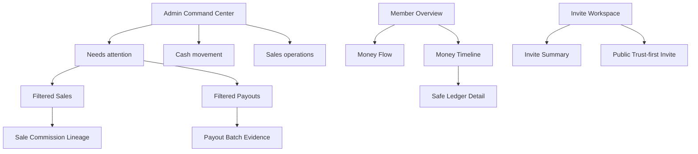
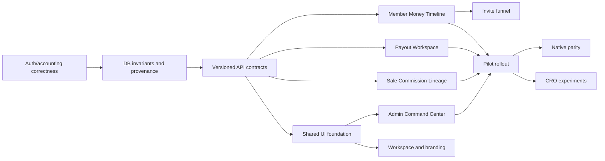

# Network Ledger Premium Redesign — Tasarım Spesifikasyonu

**Tarih:** 2026-07-14
**Durum:** Yazılı kullanıcı incelemesi bekliyor
**Uygulama:** Başlatılmadı
**Ana karar:** Ürünün imza deneyimi `Network Ledger`; ilk iş sonucu tenant-admin payout doğruluğu ve operasyon süresi.

## 1. Yönetici özeti

Americana Earn, genel amaçlı kart dashboard'u gibi görünmek yerine her satışın ve komisyonun kanıt zincirini açıklayan bir referral-finance işletim sistemi olarak konumlanacaktır.

İmza akış:

`Sale → Applied plan → Referral lineage → Commission → Maturation → Payout reservation → Settlement evidence`

Premium kalite daha fazla efekt, gradient veya kart ile değil şu üç özellik ile kurulacaktır:

1. Her para toplamı işlem seviyesine kadar açıklanabilir.
2. Operasyon ekranları “ne oldu?”dan önce “şimdi ne yapmalıyım?” sorusunu cevaplar.
3. Admin, üye web ve native istemciler aynı para, statü ve kanıt dilini kullanır.

Bu tasarım mevcut komisyon algoritmasını, payout state-machine'i, RBAC modelini veya tenant sınırlarını değiştirmez. Önce mevcut doğruluk ve güvenlik açıklarını kapatır; ardından aynı veri üzerinde daha açıklanabilir ve daha hızlı bir deneyim kurar.

## 2. Varsayımlar

Kullanıcı aksi yönde karar vermedikçe aşağıdaki varsayımlar bağlayıcıdır:

1. Birincil kullanıcı tenant owner/admin/staff; birincil iş tenant-admin payout operasyonudur.
2. İkincil kullanıcı üyedir; ilk ikincil yüzey member web wallet/Money Timeline'dır.
3. Public invite dönüşümü üçüncü ürün dilimidir; native parity web pilotundan sonra gelir.
4. İlk SLA varsayımı processing'e giren payout batch'in 48 saat içinde kanıtlı settlement'a ulaşmasıdır. Baseline farklı bir işletme ritmi gösterirse SLA tenant politikası olarak yeniden belirlenir.
5. Mevcut NestJS, Prisma, PostgreSQL, Redis, Next.js, React, Expo, Tailwind v4, shadcn/Radix, React Flow ve D3 korunur.
6. Yeni npm/pnpm/Expo paketi eklenmez; package ve lockfile değiştirilmez.
7. Runtime copy mevcut ürün gibi English-only kalır; yeni bütün metinler web ve mobile i18n sözlüklerinden gelir.
8. Tüm para alanları DB'de `BigInt`, JSON kontratında decimal cents string olarak taşınır; finansal hesapta JavaScript `Number` kullanılmaz.
9. Tarihi approval-time plan provenance bulunmuyorsa güncel plandan geçmiş gerçeklik yeniden üretilmez.
10. Gelir garantisi, doğrulanmamış müşteri sonucu, sahte sosyal kanıt veya manipülatif scarcity copy kullanılmaz.
11. Mevcut kirli worktree ve kullanıcı değişiklikleri korunur; uygulama daha sonra izole bir branch/worktree üzerinde yürütülür.
12. Repo içindeki Markdown/memory belgeleri bu tasarımı üretmek için okunmamıştır; kaynak kodu ve çalışan ürün kanıtı esas alınmıştır.

## 3. Hedefler ve başarı tanımı

### 3.1 Birincil ürün hedefi

Tenant admin, payout workspace'e girdiğinde açık işlerin sayısını ve yaşını görmeli; bir batch'i yanlış finansal statüye taşımadan reserve, transfer ve settle edebilmelidir. İhtiyaç duyduğu sale, commission, recipient snapshot ve settlement kanıtına aynı bağlamdan ulaşmalıdır.

### 3.2 North-star

**48 saat içinde kanıtlı ve mutabık payout tamamlama oranı**

Payda: processing durumuna giren `PayoutBatch`.
Pay: Aşağıdaki koşulların tamamını sağlayan batch:

- `processingStartedAt → settledAt <= 48h`
- settlement reference ve evidence mevcut
- batch item toplamı payout toplamına eşit
- bağlı ledger satırları `paid`
- canonical ledger/summary/payout reconciliation farkı `0`

### 3.3 Pilot hedefler

- Rollout öncesi en az 14 günlük baseline toplanır.
- Pilot sonunda north-star'da en az `%15` göreli artış veya median request-to-settlement süresinde en az `%15` azalma beklenir.
- Hazır test datasıyla reserve-to-settle aktif admin görev süresi iki dakikayı geçmez.
- Beş veya daha fazla moderasyonlu kullanıcı testinde katılımcıların en az `%80`i bir komisyonun nedenini, mevcut durumunu ve sonraki adımını yardım almadan bulur.
- Invite CRO deneyi ancak baseline ve telemetry güvenilirliği oluşunca başlar; hedef valid registration completion'da en az `%15` göreli artıştır.

### 3.4 Mutlak guardrail'ler

- Ledger-summary-payout reconciliation mismatch: `0`
- Duplicate payout reservation/payment: `0`
- Cross-tenant veya other-member veri okuması: `0`
- Kritik erişilebilirlik ihlali: `0`
- Para mutasyonunda duplicate client request: `0`
- Network Ledger API 5xx: `<= %0.5` ve baseline'ın `+0.2` puanından fazla değil
- Detail p95: `<= max(500ms, baseline × 1.20)`
- List p95: `<= max(800ms, baseline × 1.20)`
- Auth refresh failure: baseline'a göre `%10`dan fazla artmaz
- Payout request completion: `%5`ten fazla göreli düşmez
- p75 LCP `<= 2.5s`, INP `<= 200ms`, CLS `<= 0.1`

## 4. Kapsam

### 4.1 Kapsam içinde

- Web ve mobile refresh single-flight düzeltmesi
- Public invite kontrat uyuşmazlığının giderilmesi
- Tek canonical net commission tanımı
- Commission plan effective-date benzersizliği
- Approval-time commission plan provenance
- TOTP secret encryption tasarımı ve kontrollü legacy geçişi
- Yetki/güvenlik mutasyonları ile audit'in atomik hale gelmesi
- Historical payout export'un immutable recipient snapshot kullanması
- Bounded commission maturation
- Admin Command Center
- Sale Commission Lineage / Network Ledger
- Payout Workspace
- Member Money Timeline ve pagination
- Invite summary/funnel ve trust-first public invite
- Workspace switcher ve responsive navigation
- Runtime branding ile preview tutarlılığı
- Semantik UI primitive'leri, erişilebilirlik ve reduced-motion
- Server-side audit search/filter
- Observability, reconciliation ve kontrollü rollout

### 4.2 Kapsam dışında

- Commission oranlarını veya upline dağıtım algoritmasını değiştirmek
- Yeni payment provider, otomatik banka transferi veya billing/pricing
- Marketplace, açık affiliate discovery veya AI öneri sistemi
- Full design-system veya monorepo architecture rewrite
- Admin native uygulaması
- Logo upload/asset management
- Gamification, confetti veya leaderboard redesign
- Yeni chart/UI/state/test paketi
- Açık signup; davet temelli kayıt modeli korunur
- Tarihi plan snapshot olmadan “company retained” tutarı tahmin etmek
- Tenant rengini success/destructive/focus/body text semantiğine uygulamak
- Public homepage ve fiyatlandırma; acquisition modeli ayrıca onaylanmadan `/` davranışı değişmez

## 5. Ön koşul: doğruluk ve güvenlik kapısı

Network Ledger yüzeyinde “verified”, “exact” veya “proof” dili ancak aşağıdaki değişmezler sağlandıktan sonra kullanılabilir.

### 5.1 Auth refresh

- Web ve mobile aynı runtime context içindeki bütün 401 cevaplarını tek in-flight refresh Promise'ine bağlar.
- Her original request en fazla bir kez retry edilir.
- Başarısız refresh session'ı bir kez temizler.
- Dönen refresh token hiçbir paralel caller tarafından yeniden kullanılmaz.
- Backend refresh/cookie endpoint sözleşmesi değişmez.

### 5.2 Canonical net commission

Tek ekonomik tanım bütün dashboard, analytics, export ve testlerde kullanılır:

`netCommission = pending + payable + processing + paid`

- `reversed` durumundaki original satır ekonomik toplamda tekrar sayılmaz.
- Reversal satırı original commission'ın işaretli karşılığıdır.
- Dashboard ve analytics ayrı formüller üretmez.
- Approved → processing → paid boyunca toplam değişmez.
- Approved → void sonrasında net komisyon sıfıra döner.

### 5.3 Plan benzersizliği ve provenance

- DB otoritesi `UNIQUE(tenant_id, effective_from)` olur.
- Service precheck yalnız kullanıcı mesajını iyileştirir; yarışın doğruluk garantisi DB constraint'tir.
- Duplicate preflight sonucu sıfır değilse migration veri silmeden fail eder.
- `Sale.commissionPlanId` nullable ve additive olarak eklenir.
- Yeni approval, seçilen plan id'sini ve ledger satırlarını aynı transaction'da yazar.
- Backfill yalnız `tenant + saleDate + effectiveFrom` ile tek ve rate uyumlu plan bulunduğunda provenance atar.
- Ambiguous/missing legacy kayıt için plan adı uydurulmaz; UI `legacy rate snapshot` gösterir.
- Nullable legacy provenance tamamen çözülmeden destructive enforcement yapılmaz.

### 5.4 MFA ve mobile session

- `MFA_REQUIRED_ROLES` production startup sırasında doğrulanır; unknown, duplicate veya empty override fail-closed olur.
- Yeni TOTP secret plaintext yazılmaz.
- Versioned AES-GCM envelope ve ayrı encryption key kullanılır.
- Legacy plaintext dual-read edilir ve idempotent bounded script ile şifrelenir.
- Decrypt hatası fail-closed olur; recovery code hash davranışı değişmez.
- Native premium rollout, refresh düzeltmesine ek olarak OS secure storage onayı tamamlanmadan açılmaz.

### 5.5 Audit ve payout snapshot

- Role assignment, membership status ve güvenlik/ödeme setting mutasyonları audit insert'iyle aynı Prisma transaction'dadır.
- Audit insert başarısızsa mutation rollback olur.
- Historical paid CSV, güncel user/membership profilini değil reservation-time snapshot'ı kullanır.
- Snapshot olmayan legacy ödeme sessiz mutable fallback kullanmaz; açık operator remediation veya explicit legacy policy gerekir.
- Aynı batch/period export byte-stable olur.

### 5.6 Bounded maturation

- Bir transaction en fazla 500 due ledger satırı işler.
- `FOR UPDATE SKIP LOCKED` korunur.
- Scheduler tick başına en fazla 20 batch işler ve kalan backlog'u sonraki tick'e bırakabilir.
- Ledger ve monthly summary aynı transaction'da hareket eder.
- Her satır tam bir kez `pending → payable` geçer.

## 6. Ürün bilgi mimarisi



### 6.1 Admin navigation

- Desktop sidebar korunur.
- Mobile admin navigation dört ana öğe kullanır: Home, Sales, Payouts, More.
- More sheet permission-filtered Members, Network, Audit ve Settings içerir.
- Yedi sekmeli yatay mobile navigation kaldırılır.

### 6.2 Member navigation

- Desktop header korunur ve tenant kimliği workspace switcher olur.
- Mobile web/native primary navigation: Home, Wallet, Team, Invite.
- Header yalnız brand, workspace, notifications ve account aksiyonlarını taşır.

### 6.3 Workspace switching

Akış:

1. Kullanıcı aktif membership'i seçer.
2. `POST /me/switch-tenant` çağrılır.
3. Session `accessToken` ve `activeMembershipId` birlikte güncellenir.
4. Brand/query cache temizlenir.
5. Role-aware landing açılır.

Garantiler:

- Eski tenant verisi yeni tenant shell'i altında bir frame dahi gösterilmez.
- Busy durumda ikinci switch çağrısı yapılmaz.
- Tek membership'te kontrol interaktif menü olmaz.
- Admin-only membership native member tab'larına düşmez; mevcut privileged route'a gider.

## 7. Admin Command Center

Mevcut dashboard KPI vitrini yerine operasyon komuta merkezi olur.

### 7.1 Sıralama

1. Page header, selected period, last-updated ve refresh
2. `Needs attention` operational queue
3. Cash movement rail: Payable → Requested → Processing → Settled
4. Sales operations: draft, delivery pending, void rate
5. Performance trend ve top performers, below-the-fold

### 7.2 Operational queue

Mevcut recommendation policy korunur. Her öğe:

- allowlist edilmiş lokal title/body
- doğrulanmış count
- `oldestAgeHours`
- risk/severity
- filtreli hedef URL

Örnek deep link'ler:

- `/admin/payouts?view=processing&stale=1`
- `/admin/payouts?view=requested`
- `/admin/sales?status=draft`
- `/admin/sales?delivery=pending`

### 7.3 State modeli

- Full loading: yerleşime sadık skeleton
- Queue error: KPI'lar kalır, isolated retry gösterilir
- Analytics error: silent catch veya sonsuz skeleton olmaz
- Empty: “Operations are clear” ve last-updated
- Permission: yalnız izinli queue ve metrikler
- Stale: timestamp ve explicit refresh

### 7.4 Kabul kriterleri

- Admin ilk viewport'ta en kritik açık işin sayısını ve yaşını görür.
- Her queue item tek aksiyonla doğru filtreli listeyi açar.
- Bir bölümün hatası tüm dashboard'ı kapatmaz.
- Yetkisiz payout bilgi veya aksiyonu DOM'a render edilmez.
- Analytics below-the-fold lazy yüklenir.

## 8. Sale Commission Lineage

Mevcut Sale Drawer korunur ve Network Ledger'ın ilk kanıt zinciri olur.

### 8.1 Bölümler

1. Sale identity: amount, status, seller, sale/recorded/approved/delivered dates, refs
2. Lifecycle: Draft → Approved → Delivered; Void ayrı terminal state
3. Applied plan/provenance
4. Dikey commission lineage: Seller L0 → L1 → …
5. Calculation summary
6. Sticky action footer

### 8.2 Line item

Her satır aşağıdakileri gösterir:

- beneficiary display name ve referral code — yalnız admin projection'ında
- level
- captured rate
- signed amount
- commission/reversal türü
- pending/payable/processing/paid/reversed statüsü
- maturity date
- payout/batch bağı

### 8.3 Calculation summary

- Gross sale
- Maximum pool — yalnız exact plan provenance varsa
- Distributed positive commissions
- Reversals
- Net commission
- Unallocated/company retained — yalnız exact plan provenance varsa
- Effective distributed rate

Formüller API view-model'de hesaplanır; frontend ledger satırlarını `Number`a çevirip finansal toplam üretmez.

### 8.4 Draft ve legacy davranışı

- Draft: “Approve to calculate distribution.”
- Exact provenance: plan name, effective date, pool ve depth gösterilir.
- Legacy provenance: captured line rates gösterilir; plan name/pool/retained tahmin edilmez.
- Void: original commission ve reversal aynı level altında ayrı gösterilir.

### 8.5 Kabul kriterleri

- Admin her satırda kime, hangi level/rate ile, hangi durumda kayıt yazıldığını görür.
- API summary ile visible satırlar matematiksel olarak eşleşir.
- Status mutation sonrası drawer ve list aynı server state'e refetch olur.
- Keyboard kullanıcısı explicit View details kontrolüyle drawer'ı açar; kapanınca focus aynı kontrole döner.
- Financial mutation sırasında drawer/dialog dismiss edilemez.

## 9. Payout Workspace

Mevcut tek uzun sayfa URL-controlled operasyon workspace'e ayrılır.

### 9.1 Workspace tabs

- `ready`
- `requested`
- `processing`
- `released`
- `history`

İlk açılış önceliği: stale processing → requested → ready.

### 9.2 Bileşen sınırları

- `PayoutFlowSummary`
- `PayableSelection`
- `RequestedQueue`
- `ProcessingBatchList`
- `ReleasedBatchList`
- `PayoutHistory`
- `SettlementDialog`
- `ReleaseDialog`
- `ReservationResult`

Route page yalnız URL state, bounded query ve mutation orchestration taşır.

### 9.3 Davranış

- Her tab yalnız açıldığında paginated veri yükler.
- Reserve sonucu kalıcı result block'ta processed/skipped count ve amount gösterir.
- Processing batch row member count, period, total, start time ve short batch ID gösterir.
- Aksiyon sırası Bank CSV → Record settlement; Release destructive secondary olur.
- Internal `failed` state kullanıcı dilinde `Released batch` olarak açıklanır; DB enum değişmez.
- Settlement dialog toplam, reference ve evidence review özeti gösterir.
- CSV/download hatası görünür alert olur.
- 100-member reserve sınırı selection summary'de görünür.
- URL tab/filter içerir; ephemeral selection içermez.

### 9.4 Kabul kriterleri

- Processing para hiçbir yerde Paid olarak adlandırılmaz.
- Reference ve evidence olmadan settle mümkün değildir.
- Busy dialog Escape/backdrop/close veya ikinci request kabul etmez.
- Client selection ile server reservation sonucu farklıysa server sonucu açıkça gösterilir.
- Browser back/forward tab state'i geri getirir.
- Dar ekranda kritik aksiyon horizontal table scroll arkasında kalmaz; record-card olur.

## 10. Member Money Timeline

### 10.1 Sayfa sırası

1. Available to request ana tutarı
2. Threshold progress veya active payout mesajı
3. Money Flow: Pending → Available → In transfer → Paid
4. Month/status kontrollü Money Timeline
5. Payout request history

### 10.2 Timeline entry

- amount
- Commission/Reversal
- Level ve captured rate
- short sale ID
- current status
- pending ise exact `maturesAt`
- processing/paid ise safe payout status
- expandable “How this was recorded”

### 10.3 Gizlilik

- Member projection downline/sponsor/customer adını veya `customerRef`i dönmez.
- Settlement evidence text/reference member'a dönmez.
- İlk sürümde sale gross gösterilmez.
- Sale ID, level, captured rate, member commission amount, maturity ve payout state yeterli açıklama sınırıdır.

### 10.4 Pagination

- Web: Load older activity veya açık page kontrolü
- Native: Load older activity
- Visible count/total kullanıcıya gösterilir.
- Partial load error mevcut satırları silmez ve retry sunar.

### 10.5 Kabul kriterleri

- Dört money bucket API ile birebir eşleşir.
- `maturesAt` varsa exact tarih; yoksa “maturity date unavailable”, tahmin yok.
- Requestable=false reason açık ve CTA doğru disabled state'te.
- Status color dışında text/icon ile anlaşılır.
- 50'den fazla kaydın tamamına web ve native üzerinden ulaşılabilir.
- Reversal negatif işaret ve açıklama ile ayrışır.

## 11. Invite funnel ve public invite

### 11.1 İlk güvenilir funnel

İlk sürüm yalnız mevcut authoritative veriden türetilen adımları gösterir:

`Links created → Members joined → Email verified → First approved sale`

`Viewed` ve `signup started` event modeli onaylanana kadar UI'da gösterilmez.

### 11.2 Member invite workspace

- Latest active link hero
- Copy/share ve QR
- Funnel summary
- Active/used/expired lifecycle list
- Used invite için joined sonucu
- Expired invite için create-new aksiyonu
- Empty state'te tek net CTA

### 11.3 Public invite

- Başlık: “You're invited to join {tenantName}.”
- Public API'ye `inviterName` eklenmez.
- Brand ve tenant context görünür.
- Üç güven adımı: Join → Track eligible commissions → Request eligible payouts.
- Gelir garantisi veren copy yoktur.
- Full name, email ve password alanlarında `name`, `autocomplete`, `spellCheck` ve error linkage vardır.
- Invalid, expired, inactive tenant ve MFA continuation ayrı state'lerdir.
- Web ve native aynı shared contract ve copy kararını kullanır.

### 11.4 Kabul kriterleri

- `undefined invited you` hiçbir durumda oluşmaz.
- Funnel sayıları Invite/Membership/User/Sale verisinden test edilebilir.
- Tracked olmayan Viewed/Started adımı gösterilmez.
- QR, copy ve share aynı canonical URL'yi üretir.
- Clipboard/share failure görünürdür.
- Form password manager ve browser autofill ile çalışır.

## 12. Branding sözleşmesi

### 12.1 Tek kaynak

- Default brand constants `packages/shared` içinde tek kaynak olur.
- API, web ve mobile aynı name/monogram/tagline/primary/accent fallback'ini kullanır.
- Preview custom imitation yerine runtime'da kullanılan gerçek compositions'ı render eder.

### 12.2 Marka sınırı

- Admin workspace Americana product brand ile tarafsız kalır.
- Tenant-facing member ve public invite yüzeyleri tenant name/monogram/tagline/accent kullanır.
- Tenant primary/accent yalnız mark, decorative border ve seçili aksanda kullanılır.
- Focus, destructive, success, warning, money ve body text semantic tokenları tenant renginden etkilenmez.
- Logo upload olmadığı için tenant monogram runtime mark'tır.

### 12.3 Preview seçenekleri

- Member header
- Public invitation
- Mobile compact

### 12.4 Kabul kriterleri

- Aynı tenant web member, public invite, native member ve preview'da aynı brand alır.
- API ve client fallback birebir aynıdır.
- Brand fetch hatası safe default gösterir; layout kırılmaz.
- Preview runtime component'ını kullanır.

## 13. UI sistemi ve görsel yön

### 13.1 Renk dili

- Indigo: navigation ve primary action
- Copper: yalnız money emphasis
- Emerald: approved/paid
- Sky: payable/available
- Amber: pending/requested/processing
- Rose: void/reversal/rejected/released

Durum hiçbir zaman yalnız renkle anlatılmaz.

### 13.2 Yüzey ve hiyerarşi

- Sayfa başına bir primary surface.
- Border ve card sayısı azaltılır; grouping önce spacing, typography ve tonal surface ile kurulur.
- En fazla üç surface elevation seviyesi kullanılır.
- Glassmorphism, rastgele gradient ve decorative data chart yoktur.
- Para rakamları tabular; primary amount ve supporting totals arasında açık scale farkı vardır.

### 13.3 Ortak primitive'ler

- `StatusBadge`
- `MoneyAmount`
- `MoneyFlow`
- `AsyncSection`
- `SectionHeader`
- `WorkspaceSwitcher`
- `OperationalQueue`

`CardTitle` polymorphic/asChild heading kabul eder. Heading seviyesi route context tarafından seçilir.

### 13.4 Motion

- Overlay ve küçük state transition'ları 150–200ms.
- Financial content'te toplu stagger/delay kaldırılır.
- Press scale yalnız control feedback; data yüzeyleri hover'da hareket etmez.
- `prefers-reduced-motion` web ve native'de korunur.

### 13.5 Erişilebilirlik

- Her route'ta bir `h1`; ana section `h2`, alt section `h3`.
- Coarse pointer web control hedefi en az 44×44px.
- Native mevcut en az 46px hedefi korur.
- Dialog/drawer focus trap, scroll lock ve trigger focus restore uygular.
- Label/id/name/autocomplete/inputMode ilişkileri eksiksizdir.
- Live mutation durumu `aria-live`/native accessibility announcement ile duyurulur.
- 200% zoom'da görev kaybı olmaz.
- Table row navigasyon yerine gerçek link/button kullanılır.

## 14. API ve contract kararları

### 14.1 Shared contracts

`packages/shared` aşağıdaki versioned DTO/string union kontratlarını taşır:

- `PublicInviteResponseV1`
- `CommissionLedgerViewV1`
- `MoneyTimelineItemV1`
- `PayoutBatchEvidenceV1`
- status/amount serialization helpers

Prisma modelleri veya ORM objeleri doğrudan client contract'ı olmaz.

### 14.2 Admin sale detail — additive

Mevcut `GET /admin/sales/:id` alanları kaldırılmaz; aşağıdaki additive yapı eklenir:

```ts
interface CommissionLedgerViewV1 {
  schemaVersion: 1;
  provenance: 'exact' | 'legacy';
  plan: null | {
    id: string;
    name: string;
    effectiveFrom: string;
    poolRateBps: number;
    depth: number;
  };
  pool: {
    maximumCents: string | null;
    distributedCents: string;
    reversalCents: string;
    netCommissionCents: string;
    unallocatedCents: string | null;
  };
  entries: Array<{
    id: string;
    level: number;
    type: 'commission' | 'reversal' | 'adjustment';
    status: 'pending' | 'payable' | 'processing' | 'paid' | 'reversed';
    rateBps: number;
    amountCents: string;
    beneficiary: {
      membershipId: string;
      referralCode: string;
      displayName: string;
    };
    maturesAt: string | null;
    payoutId: string | null;
    payoutBatchId: string | null;
    createdAt: string;
  }>;
}
```

### 14.3 Member ledger detail

Yeni `GET /app/wallet/ledger/:id`:

- yalnız aktif membership'in beneficiary entry'si
- uniform not-found behavior
- safe sale ID, level, captured rate, amount, maturity ve payout state
- downline/member/customer/evidence PII içermez

### 14.4 Payout summary ve evidence

- `GET /admin/payouts/summary?period=YYYY-MM`
- `GET /admin/payouts/batches?status=&page=&pageSize=`
- `GET /admin/payouts/batches/:id`

List endpoints bounded/paginated kalır. Batch detail snapshot recipient, item set, checksum, state timeline ve admin-only settlement evidence içerir.

### 14.5 Audit search

Mevcut audit endpoint aşağıdaki server-side filtreleri kabul eder:

- `q`
- `action`
- `entity`
- `actor`
- `from`
- `to`
- `page`
- `pageSize`

Filtered `total` DB sorgusundan gelir. UI query string'i source of truth olarak kullanır.

### 14.6 Invite summary

Yeni `GET /app/invites/summary` mevcut authoritative tablolardan şunları üretir:

- issued
- active
- expired
- joined
- emailVerified
- activatedByApprovedSale

İlk sürüm schema migration veya client-view event gerektirmez.

## 15. Data invariants ve migration stratejisi

### 15.1 Değişmezler

- Commission amount captured rate/floor kuralıyla uyumludur.
- Reversal matching sale/level commission'ın exact negatifidir.
- Monthly summary bucket'ları ledger status toplamlarına eşittir.
- Payout total batch item toplamına eşittir.
- Batch item linked ledger amount ile eşleşir.
- Settled batch linked ledger status `paid` olur.
- Bir ledger satırı iki active payout/batch'e bağlanamaz.
- Migration/backfill hiçbir monetary veya status alanını değiştirmez.
- Bütün tenant-sensitive query'ler tenant'ı authenticated context'ten alır.

### 15.2 Expand-first migration

1. Duplicate plan preflight raporu.
2. Plan unique constraint.
3. Nullable `Sale.commissionPlanId` ve FK/index.
4. Engine dual-write.
5. 500-row idempotent backfill.
6. Pre/post tenant/status/type count ve sum snapshot.
7. Ambiguous/missing kayıt raporu.
8. Pilot flag/capability yalnız reconciliation sıfırsa açılır.

Destructive down migration yapılmaz. Rollback'te additive column/endpoint kalabilir.

### 15.3 TOTP migration

1. Encryption/decryption helper deploy edilir.
2. New writes encrypted, legacy dual-read olur.
3. Restored DB copy üzerinde rehearsal yapılır.
4. Bounded idempotent encryption script çalışır.
5. Plaintext count sıfır doğrulanır.
6. Legacy write kapatılır.

Encryption key production secret manager'da sağlanmadan bu adım uygulanmaz.

## 16. State, error ve mutation modeli

Her async surface explicit union kullanır:

```ts
type AsyncState<T> =
  | { status: 'idle' }
  | { status: 'loading' }
  | { status: 'ready'; data: T; updatedAt: string }
  | { status: 'empty'; updatedAt: string }
  | { status: 'error'; message: string; retryable: boolean };
```

Kurallar:

- Başlamış eski query yeni filtre sonucunun üzerine yazamaz; AbortSignal veya monotonic request-id kullanılır.
- Money mutation optimistic olarak paid/settled gösterilmez.
- Mutation network error verirse client server state'i refetch etmeden ikinci deneme açmaz.
- Busy overlay dismiss edilemez.
- Error kullanıcı girdisini silmez.
- Public auth/invite raw backend error göstermez; safe mapped copy kullanır.
- Mobile offline durumda cached para “current” diye sunulmaz; explicit offline ve last-updated gösterilir.
- Analytics/telemetry failure finansal mutation'ı asla bloklamaz.

## 17. Security ve privacy

- Client-decoded JWT yalnız presentation içindir; authorization server'dadır.
- Tenant body/query parametresinden değil authenticated actor context'ten türetilir.
- Member detail yalnız kendi beneficiary entry'sini görür.
- Other-member ve cross-tenant request uniform 404 verir.
- Admin evidence ayrı permission ile korunur.
- Member projection settlement evidence/reference, customer ref veya başka kişi adını içermez.
- Log/event payload body, token, email, customerRef, bank/evidence text veya free text içermez.
- CSV output formula/content injection kurallarına göre escape edilir.
- Audit product analytics yerine kullanılmaz; audit finansal/yetki gerçeği olarak kalır.
- Dependency advisory remediation package/lockfile değişikliği olduğu için ayrı onay kapısıdır.
- Mobile secure storage dependency onayı olmadan native rollout yapılmaz.

## 18. Performance tasarımı

- Payout tab'ları lazy ve paginated yüklenir; bütün sayfalar loop ile çekilmez.
- Ledger list keyset veya bounded page pagination kullanır.
- Detail lazy yüklenir.
- List payload hedefi `<=100KB`, detail hedefi `<=30KB`.
- Detail maksimum üç bounded DB round trip kullanır; N+1 yoktur.
- Ledger için `(tenantId, beneficiaryMembershipId, createdAt DESC)` index planı EXPLAIN ile doğrulanır.
- NetworkExplorer adjacency/root/descendant count tek pass memoized model kullanır; render içinde subtree yeniden taranmaz.
- 100k-row representative tenant üzerinde `EXPLAIN (ANALYZE, BUFFERS)` alınır.
- 25 concurrent detail read yanında payout mutation doğruluk/performance testi yapılır.
- Yeni animation/chart dependency eklenmez.

## 19. Observability ve ürün ölçümü

### 19.1 Authoritative operasyon metrikleri

İlk release yeni analytics tablosu olmadan mevcut payout, ledger, sale, invite ve audit kayıtlarından ölçülür:

- request-to-settlement p50/p90
- processing batch oldest age
- payout reconciliation mismatch
- pending commission oldest age
- invite issued/joined/verified/first-sale
- plan provenance coverage

### 19.2 API metrics

Mevcut metrics yüzeyine bounded, tenant-label içermeyen metrikler eklenir:

- ledger entries by status/type
- missing plan provenance count
- reconciliation mismatch count
- payouts/batches by status
- processing oldest age
- pending commission oldest age

Request logs route template, method, status, duration, actor role, tenant-present ve safe error code taşır. Body/PII taşımaz.

### 19.3 Interaction analytics — ask-first

Invite viewed/start ve UI interaction event'leri için first-party `ProductEvent` modeli ancak privacy/retention ve schema migration onayıyla eklenir.

Event contract:

- UUID eventId ve dedupe
- schemaVersion
- occurredAt
- source/surface
- pseudonymous session
- tenant/actor role
- variant/viewport bucket
- allowlist property'ler
- exact amount yerine amount bucket
- raw retention önerisi 90 gün, aggregate 13 ay

Telemetry audit'ten ayrı, async/best-effort ve kill-switch'li olur.

## 20. CRO deneyi sırası

1. Admin operations queue + proof side panel vs mevcut payout table
2. Member proof-chain drawer vs flat ledger
3. Trust-first invite intro vs form-first invite

Kurallar:

- Financial calculation/state machine deney varyantına göre değişmez.
- Assignment tenant-level olur; aynı network içindeki kullanıcılar farklı varyant almaz.
- Primary metric ve guardrail experiment başlamadan kaydedilir.
- Minimum 14 gün ve en az iki business/payout cycle beklenir.
- Düşük trafik varsa istatistiksel başarı iddiası yapılmaz; moderasyonlu pilot ve power/MDE hesabı kullanılır.

## 21. Project structure ve muhtemel implementation yüzeyleri

### API

- `apps/api/src/auth/*`
- `apps/api/src/reports/*`
- `apps/api/src/plans/*`
- `apps/api/src/engine/*`
- `apps/api/src/sales/*`
- `apps/api/src/payouts/*`
- `apps/api/src/wallet/*`
- `apps/api/src/invites/*`
- `apps/api/src/rbac/*`
- `apps/api/src/settings/*`
- `apps/api/src/scheduler/*`
- `apps/api/src/health/*`
- `apps/api/prisma/schema.prisma`
- additive Prisma migrations/backfill scripts
- API integration tests

### Shared

- `packages/shared/src/contracts/*`
- `packages/shared/src/constants.ts`
- `packages/shared/src/money.ts`
- `packages/shared/test/network-ledger.spec.ts`

### Web

- `apps/web/src/lib/api.ts`
- `apps/web/src/lib/auth.ts`
- `apps/web/src/lib/brand.ts`
- `apps/web/src/lib/i18n.ts`
- `apps/web/src/components/ledger/*`
- `apps/web/src/components/payouts/*`
- `apps/web/src/components/shell/*`
- `apps/web/src/components/branding/*`
- `apps/web/src/components/ui/*`
- admin/member/invite route pages
- `apps/web/src/app/globals.css`

### Native

- `apps/mobile/src/lib/api.ts`
- `apps/mobile/src/lib/auth.ts`
- `apps/mobile/src/lib/brand.ts`
- `apps/mobile/src/lib/i18n.ts`
- `apps/mobile/src/components/*`
- tab layout, wallet, invite ve public invite routes

## 22. Code style

- Existing TypeScript strict style ve Zod boundary validation korunur.
- ORM model serialize edilmeden client'a dönmez.
- Para helper'ları pure ve bigint-safe olur.
- Component state impossible kombinasyonları discriminated union ile engeller.
- Route page domain component iç mantığını taşımaz.
- Bir component tek operasyonel sorumluluğa sahip olur.
- Yeni task normalde beşten fazla dosyaya dokunmaz; büyük dilim parçalanır.

Örnek contract stili:

```ts
export type MoneyTimelineItemV1 =
  | {
      kind: 'commission';
      status: 'pending' | 'payable' | 'processing' | 'paid';
      amountCents: string;
      currency: string;
      level: number;
      rateBps: number;
      maturesAt: string | null;
    }
  | {
      kind: 'reversal';
      status: 'reversed';
      amountCents: string;
      currency: string;
      level: number;
      reasonCode: 'sale_void';
    };
```

## 23. Testing stratejisi

### 23.1 Unit/pure

- Refresh single-flight
- Canonical net commission ve reversal semantiği
- Plan provenance projection
- Bigint-safe ledger summary
- Shared invite/ledger/timeline contract
- Event allowlist/redaction — interaction analytics onaylanırsa
- MFA override validation ve encryption envelope

### 23.2 API integration

- Concurrent same-effective-date plan create
- Approved → pending → payable → processing → paid
- Approved → void → reversal/net zero
- Audit insert failure mutation rollback
- Historical payout export profile değişiminden etkilenmez
- Maturation batch limitinden büyük backlog birkaç transaction'da tamamlanır
- Cross-tenant/member IDOR uniform 404
- Legacy/null plan provenance
- Payout detail/evidence permission
- Audit server filters ve filtered total
- Invite summary aggregation
- Workspace switch

### 23.3 Data/migration

- Fresh DB migration
- Existing-schema upgrade
- Restored production-like DB rehearsal
- Duplicate plan preflight
- Idempotent plan/TOTP backfill
- Pre/post count ve sum snapshot
- 100k representative ledger rows
- Reconciliation SQL assertions

### 23.4 Browser

- Viewports: 390×844, 768×1024, 1440×900
- Admin/member, light/dark/reduced-motion
- Loading/error/empty/permission states
- URL filter ve back/forward
- Keyboard drawer/dialog/focus restore
- Busy settlement modal cannot close
- 200% zoom ve 44px target
- Heading/ARIA/live status
- Horizontal page overflow `0`
- Console/page runtime error `0`
- Parallel 401 yalnız bir refresh üretir

Mevcut Python Playwright runtime kullanılabilir; CI'ya kalıcı eklenmesi ayrıca onaylanır. Yeni npm dependency varsayılmaz.

### 23.5 Native

- Refresh concurrency pure test
- Wallet pagination/detail states
- Workspace switch atomicity
- Dark/light/reduced-motion
- Screen-reader labels
- Android emulator critical flow
- `export:check`

Native release secure storage gate'i geçmeden production'a açılmaz.

### 23.6 Manual finance walkthrough

- Sale approval
- Commission lineage
- Maturation
- Batch reservation
- Immutable CSV
- Settlement evidence
- Member projection/privacy
- Void/reversal

## 24. Komutlar

Planning sırasında veya uygulama kapılarında kullanılacak mevcut komutlar:

```powershell
pnpm lint
pnpm exec turbo run test --force
pnpm exec turbo run build --force
pnpm db:up
pnpm db:migrate
pnpm test:int
pnpm --filter @refearn/mobile export:check
pnpm --filter @refearn/api exec prisma validate
pnpm --filter @refearn/api exec prisma generate
```

Migration/backfill ve browser komutları ilgili implementation task'ında exact script path ile yazılır. Docker daemon ve disposable test DB olmadan integration/migration gate tamamlanmış sayılmaz.

## 25. Rollout ve rollback

### 25.1 Fazlar

#### Faz -1 — production blocker düzeltmeleri

Refresh, invite contract, canonical accounting, plan uniqueness, audit/snapshot/maturation ve security gates.

#### Faz 0 — instrumentation ve baseline

14 gün authoritative operasyon baseline'ı; reconciliation ve latency gözlemi.

#### Faz 1 — additive API ve foundation

Shared contracts, plan provenance dual-write, UI primitives, heading/target/overlay düzeltmeleri. Legacy UI çalışmaya devam eder.

#### Faz 2 — internal admin pilot

Command Center, Sale Commission Lineage ve Payout Workspace internal/seed tenant'ta en az 24 saat.

#### Faz 3 — bir pilot tenant admin

En az bir tam payout cycle veya yedi gün. Mismatch ve 5xx guardrail sıfır/limit içinde.

#### Faz 4 — aynı pilot member web

Money Timeline, privacy ve accessibility acceptance; yedi gün.

#### Faz 5 — invite growth

Invite summary ve trust-first public invite; önce authoritative funnel, sonra onaylı interaction telemetry.

#### Faz 6 — cohort rollout

Tenant cohort: `%5 → %25 → %50 → %100`; hold süreleri `48h → 72h → bir payout cycle`.

#### Faz 7 — native parity

Secure storage, device QA ve privacy gate sonrası.

#### Faz 8 — CRO experiments

Finansal guardrail'ler stabil ve telemetry kabul oranı yeterliyse.

### 25.2 Immediate rollback trigger

- Herhangi bir reconciliation mismatch
- Duplicate payment/reservation
- Cross-tenant/member data exposure
- 15 dakika boyunca 5xx `%1` üstü
- p95 `1s` üstü
- Auth logout/refresh failure baseline `+%20`
- Payout completion `-%10`

### 25.3 Rollback yöntemi

- UI/capability tenant için kapatılır.
- Legacy route/UI çalışmaya devam eder.
- Additive endpoint/column bırakılır.
- Financial data için destructive rollback yapılmaz.
- Telemetry ayrı kill switch ile kapanır.
- Resume öncesi reconciliation tekrar çalışır.

## 26. Risk register

| Risk | Etki | Mitigation |
|---|---|---|
| Farklı net commission tanımları | Yanlış KPI/karar | Tek canonical helper/query ve zero-mismatch gate |
| Tarihi planı yanlış yeniden kurmak | Sahte kanıt | Persisted plan id, nullable legacy provenance |
| IDOR/tenant sızıntısı | Kritik privacy/security | Ayrı admin/member projection ve integration test |
| Büyük ledger/N+1 | Yavaş detail/list | Lazy detail, bounded pagination, index ve load test |
| Payout modal belirsiz sonucu | Duplicate mutation | Busy nondismissible state ve server refetch |
| UI/API rollout drift | Kırık tenant deneyimi | Additive contracts ve legacy route compatibility |
| Telemetry audit'i kirletir | Yanlış denetim izi | Ayrı store, allowlist, best-effort ve kill switch |
| Mobile stale/offline para | Güven kaybı | Last-updated/offline state; no optimistic money |
| Düşük trafik A/B sonucu | Yanlış karar | Moderated pilot ve power/MDE hesabı |
| Migration veri kaybı | Kritik finansal zarar | Expand-only, pre/post sums, restored-DB rehearsal |
| Dependency advisory | Bilinen güvenlik riski | Reachability triage ve explicit dependency approval |
| Dirty worktree overlap | Kullanıcı değişikliği kaybı | İzole branch/worktree ve exact-file staging |

## 27. Boundaries

### Her zaman yapılır

- Tenant isolation ve server authorization
- Bigint-safe para hesabı
- Test önce/regression önce yaklaşımı
- Mutation ile audit'in aynı transaction sınırı
- Additive/expand-first migration
- Error/loading/empty/permission states
- Keyboard, focus, reduced-motion ve responsive doğrulama
- Her task sonrası targeted test; her checkpoint'te lint/test/build
- Kullanıcı değişikliklerini koruma

### Önce açık onay alınır

- `MFA_SECRET_ENCRYPTION_KEY` ve production secret/config değişikliği
- `expo-secure-store` veya başka package/lockfile değişikliği
- Dependency advisory remediation
- ProductEvent schema, privacy consent ve retention
- External analytics/metrics/alert provider
- Pilot tenant ve gerçek payout SLA
- Admin'in görebileceği customer/evidence PII sınırı
- Yeni email/push lifecycle bildirimi
- Legal/income disclaimer ve final product/brand copy
- Public homepage/acquisition davranışı
- Platform UI'dan feature/capability toggle

### Asla yapılmaz

- Secret veya token commit etmek/loglamak
- Finansal kayıt silmek veya geçmişi current state'ten uydurmak
- Failing testi silerek gate'i geçmek
- Tenant'ı client body/query'den güvenmek
- Member'a downline/customer/evidence PII açmak
- Para state'ini telemetry veya optimistic UI ile belirlemek
- Destructive migration/reset/clean komutu
- Kullanıcı değişikliklerini stage/commit etmek

## 28. Definition of Done

Bu tasarım ancak aşağıdaki koşulların tamamı sağlandığında tamamlanmış sayılır:

- Bütün P0 doğruluk/güvenlik acceptance testleri geçer.
- Financial reconciliation bütün test/pilot tenant'larda sıfırdır.
- Fresh ve upgrade migration rehearsal geçer.
- Admin sale→ledger ve payout reserve→settle akışı E2E geçer.
- Member Money Timeline privacy/pagination akışı geçer.
- Invite valid/expired/MFA akışı geçer.
- 390, 768 ve 1440 genişliklerinde runtime error ve page overflow yoktur.
- Keyboard, focus restore, 200% zoom, dark/light ve reduced-motion doğrulanır.
- `pnpm lint`, fresh unit tests, integration tests, build ve mobile export gate'leri geçer.
- Current high dependency advisories reachability bazında fix edilmiş veya yazılı risk kabulü almıştır.
- Pilot north-star/guardrail raporu hazırlanmıştır.
- Rollback rehearsal yapılmıştır.
- Source, test ve migration dosyaları planlanan scope dışına taşmamıştır.
- Repo source değişiklikleri ve çalıştırılan bütün kontroller handoff'ta listelenmiştir.

## 29. Dependency graph ve delivery sırası



Uygulama planı bu graph'ı vertical S/M task'lara bölecektir. Database constraint ve contract işleri sıralı; bağımsız web component, API test ve native hazırlık işleri contract sabitlendikten sonra paralel yürütülebilir.

## 30. Açık karar durumu

Web admin, web member ve invite tasarımı için blocking açık soru yoktur. Bölüm 27'deki ask-first maddeler ilgili task başlamadan açık kullanıcı onayı gerektirir. Özellikle native production rollout, TOTP production encryption, package/lockfile değişiklikleri ve interaction analytics kendiliğinden yetkilendirilmiş sayılmaz.
