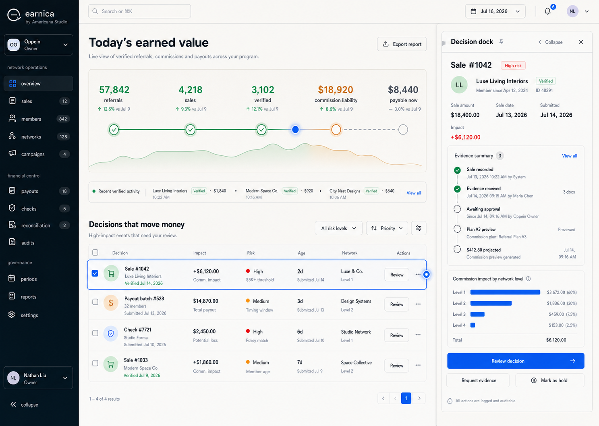

# Earnica Uçtan Uca Ürün ve Arayüz Yeniden Tasarım Spesifikasyonu

**Tarih:** 2026-07-16

**Durum:** Görsel yön ve yazılı spesifikasyon kullanıcı tarafından onaylandı

**Ürün adı:** Earnica

**Marka onayı:** `earnica` — `by Americana Studio`
**Görsel yön:** Onaylanan 3 numaralı ana çalışma alanı ile 2 numaralı Decision Desk yaklaşımının birleşimi

## 1. Karar özeti

Earnica, mevcut ekranların üzerine yeni renkler uygulanmış bir tema olmayacak. Web ve mobil ürün; aynı marka dili, aynı durum sözlüğü, aynı finansal güven ilkeleri ve role göre değişen tek bir arayüz sistemi altında yeniden kurulacak.

Ana deneyim iki yoğunluk seviyesinden oluşur:

1. **Operations Workspace:** Günlük çalışma için sakin, açık ve taranabilir ana alan. Koyu ink yan navigasyon, warm pearl içerik yüzeyi, canlı değer hattı, karar listesi ve bağlamsal sağ panel kullanır.
2. **Decision Desk:** Para, risk veya yetki içeren yüksek etkili işlemlerde açılan daha yoğun çalışma alanı. Kanıt zaman çizelgesi, komisyon etkisi, uygunluk durumu, audit bilgisi ve açık eylem kapsamı gösterir.

Bu mimari bütün rollere aynı mantıkla yayılır:

- **Admin:** özet çalışma alanı → karar listesi → Decision Desk.
- **Üye:** kazanç özeti → ödeme hazırlığı / sıradaki en iyi eylem → ayrıntı.
- **HQ:** şirket portföyü → şirket incelemesi → yönetsel eylem.
- **Mobil:** aynı bilgi mimarisi ve durum dili; masaüstü tablolarının küçültülmüş kopyası değil, göreve uyarlanmış yerel akışlar.

## 2. Varsayımlar

Bu belge aşağıdaki varsayımlarla yazılmıştır. Belgenin onaylanması bu varsayımların da onaylandığı anlamına gelir.

1. **Earnica kullanıcıya görünen tek ürün adıdır.** Eski Refearn adı kullanıcı arayüzü, metadata, e-posta görünümü, mobil uygulama adı ve marka varlıklarından kaldırılır.
2. **Americana Studio ana marka olarak kalır.** `by Americana Studio` ifadesi güven imzasıdır; ürün adından daha düşük görsel ağırlıkta kullanılır.
3. **İlk dağıtım bir alt alan adında yapılacaktır.** Kesin domain bu tasarım çalışmasının parçası değildir.
4. **Mevcut komisyon, satış, ödeme, rol ve audit kuralları korunur.** Bu çalışma iş motorunu yeniden yazmaz; gerekli veriyi doğru yerde görünür ve anlaşılır kılar.
5. **Web ana operasyon yüzeyidir; mobil üye odaklı eşdeğer deneyimdir.** Mobilde yönetim özelliklerinin tamamını taklit etmek hedef değildir.
6. **İngilizce web için başlangıç dilidir.** Bütün kullanıcı metinleri ortak i18n anahtarlarından gelir; Türkçe karşılıklar mobil ve web arasında aynı anlamı taşır. Varsayılan dil değişikliği ayrıca kararlaştırılabilir.
7. **Para birimi tenant/şirket bağlamında gösterilir.** Farklı para birimleri tek bir toplam gibi birleştirilmez.
8. **Mevcut teknoloji yığını ve kurulu bileşenler kullanılır.** Yeni paket eklemek, paket kimliklerini yeniden adlandırmak veya deployment altyapısını değiştirmek bu tasarımın varsayılan kapsamı değildir.

## 3. Amaç

### 3.1 Kullanıcı amacı

Earnica kullanan kişi her ekranda üç soruya hızlı cevap alabilmelidir:

1. Şu anda ne durumda?
2. Neden bu durumda?
3. Güvenli bir sonraki eylemim nedir?

### 3.2 Ürün amacı

- Çocuksu, jenerik veya “kartlarla doldurulmuş dashboard” algısını ortadan kaldırmak.
- Finansal operasyon ürününe uygun güven, ciddiyet ve karar netliği oluşturmak.
- Admin, üye, HQ ve mobil deneyimlerini tek bir Earnica sistemi altında birleştirmek.
- Satıştan komisyon kazancına ve ödeme mutabakatına kadar değer akışını görünür kılmak.
- Kritik işlemlerde yanlış kapsam, eksik bilgi ve yetki belirsizliği riskini azaltmak.
- Davet ve kayıt akışlarında güveni ve tamamlanma oranını artırmak.

### 3.3 Başarı tanımı

Yeniden tasarım tamamlandığında:

- Her kullanıcıya görünen route Earnica markasını ve ortak tasarım tokenlarını kullanır.
- Aynı kavram bütün ekranlarda aynı durum adı, renk ve davranışla temsil edilir.
- Kritik eylemler, etkilenecek kayıt sayısını ve kapsamı onay öncesinde açıkça gösterir.
- Ödeme engelleri yalnızca backend'de kalmaz; kullanıcıya sebep ve çözüm olarak sunulur.
- Masaüstü ve mobilde temel üye akışları işlevsel olarak eşdeğerdir.
- Arayüz WCAG 2.2 AA hedeflerini ve azaltılmış hareket tercihini karşılar.

## 4. Kapsam

### 4.1 Web route envanteri

| Alan | Mevcut route | Earnica hedefi |
| --- | --- | --- |
| Public | `/` | Ürün vaadi, güven ve rol bazlı giriş noktası |
| Davet | `/i/[code]` | Davet eden kişi/şirket güveni, program özeti, açık disclaimer ve kayıt |
| Auth | `/login` | Tek, sakin giriş yüzeyi; şifre ve MFA durumları |
| Auth | `/verify-email` | Doğrulama durumu, yeniden gönderim ve net sonraki adım |
| Auth | `/reset-password` | Güvenli şifre yenileme ve başarı geri bildirimi |
| Auth | `/mfa-setup` | QR/secret, doğrulama ve recovery akışı |
| Üye | `/app` | Ödeme hazırlığı, canlı kazanç hattı ve sıradaki en iyi eylemler |
| Üye | `/app/wallet` | Kazançtan settlement'a ödeme yaşam döngüsü |
| Üye | `/app/team` | Doğrudan ekip, gizlilik sınırları ve gerçek nudge eylemleri |
| Üye | `/app/invite` | Kişisel davet merkezi ve paylaşım kanalları |
| Admin | `/admin` | Operations Workspace ve karar kuyruğu |
| Admin | `/admin/sales` | Satış inceleme, kanıt ve komisyon etkisi Decision Desk'i |
| Admin | `/admin/members` | Üye listesi, uygunluk, rol ve bağlamsal ayrıntı |
| Admin | `/admin/tree` | Ağ keşfi, arama ve hiyerarşik inceleme |
| Admin | `/admin/payouts` | Ödeme operasyonunun görev odaklı alt görünümleri |
| Admin | `/admin/audit` | Değiştirilemez olay akışı ve bağlamsal audit incelemesi |
| Admin | `/admin/settings` | General, Brand, Notifications, People & Roles, Payments, Plans, Security, Data |
| HQ | `/platform` | Şirket portföyü ve portföy düzeyi risk/performans özeti |
| HQ | `/platform/companies/[id]` | Şirket incelemesi, plan/billing ve yaşam döngüsü eylemleri |

### 4.2 Mobil route envanteri

| Alan | Mevcut route | Earnica hedefi |
| --- | --- | --- |
| Root | `/` | Oturum ve role göre güvenli yönlendirme |
| Auth | `/login` | Web ile aynı kimlik doğrulama semantiği ve MFA devamı |
| Auth | `/mfa-setup` | Kurulum, doğrulama ve recovery parity |
| Güvenli eylem | `/privileged` | Step-up doğrulama ve hassas eylem açıklaması |
| Davet | `/i/[code]` | Disclaimer dahil web ile aynı güven/kayıt sözleşmesi |
| Üye tab | Home | Ödeme hazırlığı ve sıradaki eylem |
| Üye tab | Wallet | Mobil ödeme yaşam döngüsü |
| Üye tab | Team | Mobil ekip görünümü ve davet/nudge |
| Üye tab | Invite | Paylaşım ve davet takibi |

### 4.3 Route dışı kullanıcı yüzeyleri

Earnica sistemi yalnızca sayfalardan oluşmaz. Aşağıdaki yüzeyler de aynı marka, terminoloji ve erişilebilirlik sözleşmesine dahildir:

- web metadata, favicon ve social preview,
- mobil app name, icon ve splash,
- auth, davet, satış, güvenlik ve ödeme e-posta şablonları,
- push notification başlık ve gövdeleri,
- QR/davet paylaşım görselleri,
- kullanıcıya indirilen CSV/export başlıkları ve durum metinleri,
- kullanıcıya gösterilen printable ödeme/check özetleri; hukuki/bankacılık formatı ayrıca korunur.

### 4.4 Kapsam dışı

- Komisyon motorunun veya mevcut finansal kuralların yeniden tasarlanması.
- Yeni ödeme sağlayıcısı entegrasyonu.
- Veritabanı şeması değişikliği; yalnızca tasarımın gerektirdiği veri mevcut API'de hiç yoksa ayrıca onay alınır.
- Yeni UI, animasyon veya chart paketi eklenmesi.
- Tailwind sürüm göçü; mevcut manifestteki Tailwind v4.3.1 temel alınır.
- İç paket adlarının (`@refearn/*`), environment key'lerinin veya migration geçmişinin toplu yeniden adlandırılması.
- Üretim deploy'u, domain DNS değişikliği ve marka/ticari marka hukuki uygunluk incelemesi.
- Mobilde tam admin/HQ masaüstü işlev seti.

## 5. Deneyim ilkeleri

### 5.1 Kanıt, süsten önce gelir

Renk, grafik ve animasyon; verinin nedenini gizlemek için değil, durumu daha hızlı anlatmak için kullanılır. Bir finansal kararın yanında kanıt, etkisi ve audit izi bulunur.

### 5.2 Tek bir ana hiyerarşi

Sayfalar kart koleksiyonuna dönüşmez. Varsayılan yapı:

1. bağlam başlığı,
2. birincil değer/iş akışı,
3. karar veya kayıt listesi,
4. seçili kayıt için dock/sheet.

Bir bileşen yalnızca bağımsız bir yüzey, eylem sınırı veya anlamlı grup olduğunda “card” olur.

### 5.3 Yoğunluk ihtiyaca göre artar

Özet ekran sakin ve taranabilir kalır. Ayrıntı, kullanıcı bir kayıt seçtiğinde sağ dock veya Decision Desk içinde açılır. Her bilgiyi ilk ekranda göstermek hedef değildir.

### 5.4 Rol görünürlük değil yetenek üretir

Bir buton yalnızca kullanıcının route rolüne göre değil, backend'den gelen capability ve kayıt durumuna göre görünür/aktif olur. Devre dışı eylem sebebi touch ve klavyede de bulunan inline/helper açıklamayla belirtilir; tooltip yalnız ek yardımcıdır.

### 5.5 Finansal durum açık ve geri izlenebilirdir

“Paid” gibi belirsiz tek durum kullanılmaz. Kullanıcı ödeme yöntemine uygun gerçek aşamayı görür ve destekleyen event/audit kaydına ulaşabilir.

### 5.6 Premium, sakinlik ve hassasiyettir

Premium görünüm; büyük gradientler, parlak cam efektleri veya gereksiz gölgelerle değil; tipografi, boşluk, hizalama, veri formatı, ince çizgiler ve tutarlı etkileşimlerle kurulur.

## 6. Marka sistemi

### 6.1 İsim kullanımı

- Logo/wordmark: tam olarak küçük harf `earnica`.
- Cümle içi ürün adı: `Earnica`.
- İmza: `by Americana Studio`.
- Kullanıcıya görünen eski ürün adı bulunmaz.
- Teknik paket adları bu aşamada değişmez ve kullanıcı yüzeyine sızdırılmaz.

### 6.2 Logo fikri

Küçük `e`, tek bir ledger trace çizgisi gibi başlar ve doğrulama çentiğiyle sonlanır. İşaret şu üç anlamı taşır:

- kazanılan değer,
- ağ boyunca izlenebilir hareket,
- doğrulanmış sonuç.

Final marka teslimleri:

- yatay wordmark,
- bağımsız `e` işareti,
- açık ve koyu zemin varyantları,
- favicon,
- mobil app icon,
- sosyal paylaşım görseli,
- email/header için küçük imza varyantı.

Logo, CSS şekilleri veya JSX içinde elle çizilmiş sahte bir işaret olarak üretilmez. Onaylı kaynak varlık oluşturulur ve uygulama onu kullanır.

### 6.3 Logo hareketi

- İlk anlamlı yüklemede kaynak logo varlığı 480 ms'lik maskeli bir reveal ile görünür.
- Reveal sonunda doğrulama çentiğinde tek bir cobalt→mint durum geçişi olur.
- Aynı browser tab session'ında (`sessionStorage`) veya aynı native app process yaşamında navigasyon sırasında animasyon tekrarlanmaz; auth session süresiyle ilişkilendirilmez.
- `prefers-reduced-motion: reduce` durumunda logo doğrudan görünür.
- Sürekli dönen, parlayan veya dikkat isteyen logo animasyonu kullanılmaz.

### 6.4 Earnica / tenant marka hiyerarşisi

Earnica ürün ve güvenlik çerçevesidir; tenant markası program bağlamıdır. Tenant hiçbir yüzeyde Earnica'nın kimlik, güvenlik veya ödeme sağlayıcısı olduğu izlenimini silemez.

| Yüzey | Birincil marka | İkincil marka | Tenant sınırı |
| --- | --- | --- | --- |
| Public landing | Earnica | by Americana Studio | Tenant yok |
| Invite acceptance | Earnica | `Invited by {tenant}` + izinli tenant logo | Logo en fazla Earnica wordmark yüksekliğinde; shell rengi değişmez |
| Login / MFA / recovery | Earnica | Seçili tenant yalnız bağlam metni | Auth kontrol ve güvenlik renkleri değişmez |
| Member shell | Earnica | Tenant adı/context switcher | Tenant rengi yalnız küçük accent/mark alanında |
| Admin / HQ shell | Earnica | Aktif tenant/şirket | Navigasyon ve status tokenlarını değiştiremez |
| Email / push | Earnica gönderici kimliği | Tenant adı ve izinli küçük logo | Güvenlik ve işlem mesajlarında Earnica kimliği kalır |
| QR / share | Earnica güven imzası | Tenant/inviter bağlamı | QR quiet zone ve okunabilirlik korunur |
| Export / printable | Earnica ürün kaynağı | Tenant başlığı | Finansal durum ve hukuki metinler temalanmaz |

Tenant marka verisi eksik, bozuk veya kontrast dışıysa Earnica fallback'i kullanılır. Tenant yüklemeleri boyut, format, erişilebilir ad ve güvenli URL kurallarından geçer.

### 6.5 Marka asset sözleşmesi

Source-of-truth dosyaları:

- `earnica-mark.svg`
- `earnica-wordmark.svg`
- `earnica-wordmark-inverse.svg`

SVG export'ları tanımlı `viewBox`, path tabanlı onaylı artwork ve gereksiz metadata içermeyen optimize edilmiş kaynaklardır; JSX/CSS içinde yeniden çizilmez. Wordmark minimum 96 px genişlikte, bağımsız mark web'de minimum 20 px ve native'de minimum 24 pt kullanılır. Clear space mark yüksekliğinin en az `0.5×` değeridir.

Zorunlu raster/export seti:

| Asset | Boyut / kural |
| --- | --- |
| `favicon.ico` | 16/32/48 px çoklu boyut |
| `favicon-32.png` | 32×32 |
| `apple-touch-icon.png` | 180×180, opaque background |
| PWA icon | 192×192 ve 512×512 |
| iOS app icon | 1024×1024, transparency yok |
| Android adaptive foreground | 432×432; artwork center safe zone içinde |
| Android adaptive background | solid Earnica ink veya onaylı light varyant |
| `og-earnica.png` | 1200×630 |
| Email wordmark | 640×160 source; 320×80 render size |

Monochrome tek-renk fallback print, disabled environment ve dar email client'ları için bulunur. Dosyalar content hash/version ile cache edilir; asset değişimi eski cache'i kırar.

Logo yanında görünen `Earnica` metni zaten erişilebilir adı sağlıyorsa görsel `aria-hidden`/boş alt ile dekoratiftir. Tek başına logo linki `aria-label="Earnica home"` taşır. Email ve social görsellerinde anlamlı alt metin bulunur; app icon için UI içinde tekrar eden alt metin üretilmez.

## 7. Görsel sistem

### 7.1 Ana tema

Varsayılan Earnica çalışma alanı **Obsidian + Pearl** yaklaşımıdır:

- koyu ink navigasyon,
- warm pearl ana canvas,
- beyaz operasyon yüzeyleri,
- cobalt birincil eylem,
- earned amber parasal vurgu,
- verification mint doğrulanmış durum.

Mevcut kullanıcı-seçimli koyu tema korunur ve aynı semantik tokenlarla desteklenir. Varsayılan ve birincil görsel referans, açık pearl çalışma alanı + ink navigasyondur; koyu tema bu hiyerarşinin neon veya glass varyantına dönüşmez.

### 7.2 Renk tokenları

| Token | Değer | Kullanım |
| --- | --- | --- |
| `--earnica-ink-950` | `#0A1020` | Yan navigasyon, yüksek kontrast yüzey |
| `--earnica-ink-800` | `#1B263A` | Başlık ve güçlü metin |
| `--earnica-pearl-50` | `#F6F4EE` | Ana canvas |
| `--earnica-surface` | `#FFFFFF` | Table, dock ve form yüzeyleri |
| `--earnica-line` | `#DDE2EA` | Hairline sınırlar |
| `--earnica-muted` | `#667085` | İkincil metin |
| `--earnica-cobalt-600` | `#2453D4` | Birincil eylem, aktif state, odak |
| `--earnica-cobalt-100` | `#E9EEFF` | Seçim ve bilgi yüzeyi |
| `--earnica-amber-600` | `#96540A` | Para/kazanç metni ve pending vurgu |
| `--earnica-amber-100` | `#FFF1D6` | Para/kazanç arka planı |
| `--earnica-mint-700` | `#127052` | Doğrulanmış/settled metni |
| `--earnica-mint-100` | `#DCF7EC` | Doğrulanmış/settled arka planı |
| `--earnica-rose-700` | `#B4233A` | Hata, risk ve destructive eylem |
| `--earnica-rose-100` | `#FDE7EB` | Hata/risk arka planı |

Primitive renkler doğrudan component içinde kullanılmaz. Light/dark semantic alias'lar:

| Semantic token | Light | Dark | Kullanım |
| --- | --- | --- | --- |
| `--canvas` | `#F6F4EE` | `#0A1020` | Uygulama zemini |
| `--surface` | `#FFFFFF` | `#111A2B` | Ana çalışma yüzeyi |
| `--surface-raised` | `#FFFFFF` | `#17243A` | Dock, popover, dialog |
| `--text-primary` | `#1B263A` | `#F4F6FA` | Normal metin ve başlık |
| `--text-secondary` | `#667085` | `#A8B4C6` | Yardımcı metin |
| `--border-subtle` | `#DDE2EA` | `#334158` | Bölüm ayırıcı |
| `--border-control` | `#7F8B9E` | `#5B6B85` | Form/control sınırı |
| `--action` | `#2453D4` | `#9DB2FF` | Birincil eylem / aktif indicator |
| `--action-hover` | `#1D46B6` | `#B6C7FF` | Hover |
| `--action-pressed` | `#183A97` | `#879FFF` | Pressed |
| `--on-action` | `#FFFFFF` | `#0A1020` | Action üzeri metin/ikon |
| `--focus` | `#2453D4` | `#B6C7FF` | Focus ring |
| `--selected-surface` | `#E9EEFF` | `#1A2A52` | Seçili satır/öğe |
| `--disabled-surface` | `#EFF1F4` | `#1D2738` | Disabled kontrol |
| `--disabled-text` | `#8A94A5` | `#718098` | Disabled label |

Dark yüzeyde light cobalt action alias kullanılır; light palette'teki `#2453D4` koyu ink üzerinde active indicator veya focus olarak kullanılmaz. Dark status çiftleri `amber #F1B86B / #3A2A12`, `mint #66D5AE / #0F2E27` ve `rose #FF9AA7 / #3B1B25` olur.

Kurallar:

- Amber yalnızca para, kazanım ve bekleyen değer için kullanılır; genel CTA rengi değildir.
- Mint yalnızca doğrulanmış veya başarıyla sonuçlanmış state için kullanılır.
- Cobalt navigasyon, seçim ve kullanıcı eylemini temsil eder.
- Renk tek başına durum taşımaz; ikon, metin ve gerektiğinde pattern ile desteklenir.
- Mor, neon, kripto estetiği, altın lüks klişesi ve glassmorphism kullanılmaz.
- Tanımlanan normal metin/background çiftleri en az 4.5:1; gerekli UI boundary/focus göstergeleri en az 3:1 kontrast verir. Implementasyon sırasında hover, pressed, selected, disabled, error ve dark state'ler otomatik ve görsel olarak yeniden doğrulanır.

### 7.3 Tipografi

Mevcut font altyapısı korunur:

- Başlık/marka: `Sora`, 600–700 ağırlık.
- UI ve uzun metin: `Inter`, 400–600 ağırlık.
- Para, oran ve tarih: tabular numerals.

Ölçek:

| Rol | Boyut / satır | Kullanım |
| --- | --- | --- |
| Display | `32/38`, 700 | Ana değer veya public hero; sayfada en fazla bir kez |
| H1 | `24/32`, 700 | Sayfa başlığı |
| H2 | `18/26`, 600 | Ana bölüm |
| H3 | `15/22`, 600 | Alt bölüm / dock başlığı |
| Body | `14/21`, 400 | Varsayılan UI metni |
| Small | `12/18`, 500 | Meta ve yardımcı bilgi |
| Label | `11/16`, 600 | Uppercase değil; kısa alan etiketi |

Tamamı büyük harf başlıklar ve aşırı letter-spacing kullanılmaz. Para değerleri sağa hizalanır, currency kodu gerektiğinde açıkça yazılır.

### 7.4 Geometri, boşluk ve gölge

- 4 px temel spacing grid.
- Ana sayfa yatay padding: desktop 32 px, tablet 24 px, mobile 16 px.
- Bölüm arası dikey ritim: 24–32 px.
- Kontrol yüksekliği: desktop 36–40 px, touch yüzeyi minimum 44 px.
- Radius: kontrol 8 px, panel 10–12 px, modal/sheet 14 px.
- Hairline border birincil ayırıcıdır.
- Ana canvas üzerinde dekoratif drop-shadow kullanılmaz.
- Floating sheet, command ve modal için tek düşük yoğunluklu gölge seviyesi kullanılır.
- İç içe radius ve nested card katmanları sınırlandırılır.

### 7.5 İkonografi ve veri görselleştirme

- Mevcut Lucide ikonları kullanılır; emoji veya karışık ikon ailesi kullanılmaz.
- İkonlar metin yerine geçmez; belirsiz eylemlerde label/tooltip bulunur.
- Grafik yalnızca trend, dağılım veya ilişki metinden daha hızlı anlatılıyorsa kullanılır.
- Dashboard'u canlandırmak için dekoratif donut/line chart eklenmez.
- Ağ görünümü işlevsel keşif aracıdır; seçim, arama ve hiyerarşi okunabilirliği önceliklidir.

## 8. Motion ve arayüz hissi

### 8.1 Motion tokenları

| Motion | Süre | Eğri | Kullanım |
| --- | --- | --- | --- |
| Micro | 140 ms | `cubic-bezier(.2,.7,.3,1)` | hover, press, checkbox, badge |
| Surface | 200 ms | `cubic-bezier(.2,.7,.3,1)` | popover, tab içerik geçişi |
| Dock open | 280 ms | `cubic-bezier(.22,1,.36,1)` | Decision Dock/Sheet açılışı |
| Dock close | 200 ms | `cubic-bezier(.4,0,1,1)` | Decision Dock/Sheet kapanışı |
| Data | 200 ms | `cubic-bezier(.2,.7,.3,1)` | sayı ve state değişimi |
| Brand reveal | 480 ms | `cubic-bezier(.22,1,.36,1)` | İlk session logo reveal |
| Trace pulse | 720 ms | `cubic-bezier(.2,.7,.3,1)` | Authoritative yeni value event'i |

### 8.2 İmza hareketi: earned-value trace

- Yeni doğrulanmış değer geldiğinde cobalt pulse bir kez ilgili trace segmentinden geçer.
- Doğrulanmış node mint'e oturur.
- Pending/future segment amber ve kesikli görünür.
- Sayılar dikey masked transition ile değişir; alan genişliği sabit tutulur.
- Row press/selection en fazla 1 px hareket ve renk değişimi kullanır.
- Sürekli loop, parallax, büyük blur ve layout tetikleyen animasyon yoktur.

Uygulama davranışı:

| Hareket | Property | Tetikleme | Interrupt / reversal |
| --- | --- | --- | --- |
| Logo reveal | `clip-path`, `opacity` | Session'da ilk Earnica mount | Route değişirse final state'e snap; reverse yok |
| Dock | `transform: translateX`, `opacity` | `selected` query değişimi | Açılırken kapanırsa mevcut computed state'ten close |
| Number | masked child `transformY`, `opacity` | Server-confirmed değer değişimi | Yeni değer gelirse mevcut state'ten son değere coalesce |
| Trace pulse | `transform`, `opacity` | Yeni benzersiz authoritative event | Event burst tek pulse + toplu sayı güncellemesine coalesce |
| Row response | `transformY(1px)`, background/border | pointer/keyboard press | Release/cancel anında 140 ms içinde geri döner |

Yeni animasyon paketi gerekmez; CSS transition/keyframe ve mevcut platform API'leri kullanılır.

### 8.3 Reduced motion

- Tüm anlamlı state değişimleri animasyonsuz da anlaşılır.
- `prefers-reduced-motion` durumunda hareket kaldırılır; gerekliyse 80 ms altında opacity geçişi kalır.
- Animasyon hiçbir zaman işlem tamamlandı kanıtı yerine kullanılmaz; metinsel state güncellenir.

## 9. Ortak shell mimarisi

### 9.1 Earnica App Shell

Ortak shell şu bölgelerden oluşur:

1. **Ink Sidebar / Mobile Tab Bar:** role ve capability'ye göre navigasyon.
2. **Context Header:** tenant/şirket, dönem, global arama, bildirimler ve hesap menüsü.
3. **Page Context:** tek H1, kısa açıklama, birincil eylem ve gerekliyse filtreler.
4. **Workspace Canvas:** route içeriği.
5. **Decision Dock / Mobile Sheet:** seçili kayıt ayrıntısı ve eylemler.

Kurallar:

- Sidebar ürün bölümünü; header mevcut bağlamı; H1 sayfanın işini söyler. Aynı başlık üç yerde tekrarlanmaz.
- Sidebar koyu ink, içerik warm pearl'dir.
- Seçili route dark semantic `--action` indicator ve yeterli metin kontrastıyla belirtilir; raw light cobalt dark sidebar üzerinde kullanılmaz.
- Tenant/şirket değiştirme yalnızca yetkili kullanıcıda görünür.
- Kritik bağlam değişimi yapıldığında filtreler ve seçili kayıt güvenli biçimde sıfırlanır.

### 9.2 Responsive davranış

- `>=1440 px`: 240 px kalıcı sidebar; açık dock 400 px split column olur ve canvas minimum 720 px kalır.
- `1280–1439 px`: 240 px kalıcı sidebar; dock 400 px sağ overlay olarak açılır ve canvas ölçüsünü değiştirmez.
- `1024–1279 px`: 72 px icon rail; dock 400 px sağ overlay olarak açılır ve canvas ölçüsünü değiştirmez.
- `768–1023 px`: compact top header + modal navigation drawer; detail en fazla 520 px sağ sheet olur.
- `<768 px`: web member görünümünde compact top header + dört bottom tab; admin/HQ web'de compact header + navigation drawer. Bütün list→detail akışları tam ekran detail olur.
- Native mobil yalnız üye görevleri için dört bottom tab kullanır; admin/HQ için desktop navigation kopyalanmaz.
- Hiçbir route 390 px viewport'ta sayfa düzeyinde yatay scroll üretmez.
- Geniş finansal tablo mobilde küçültülmez; öncelikli alanları gösteren list/card ve detail görünümüne dönüşür.
- Responsive QA tam sınır çiftlerinde yapılır: 767/768, 1023/1024, 1279/1280 ve 1439/1440 px; ayrıca 320 CSS px reflow doğrulanır.

### 9.3 Route erişimi ve tenant izolasyonu

Aşağıdaki semantic access adları yeni permission enum'u dayatmaz; mevcut backend permission/capability sonuçlarının görünüm sözleşmesidir.

| Route ailesi | Unauthenticated | Gerekli erişim yok | Gerekli erişim var |
| --- | --- | --- | --- |
| Public / invite | Allow; invite state'e göre kontrollü görünüm | Allow; hassas tenant verisi yok | Allow; mevcut oturum için doğru devam yolu |
| Auth | Allow | Allow | Route + assurance durumuna göre Bölüm 9.4 guard'ı |
| `/app/*` | Login + allowlist doğrulanmış `returnTo` | 403 + güvenli ana sayfa yolu | `memberAccess` ile allow |
| `/admin/*` | Login + allowlist doğrulanmış `returnTo` | 403; admin verisi hydrate edilmez | `adminAccess` ile allow |
| `/platform/*` | Login + allowlist doğrulanmış `returnTo` | 403; HQ verisi hydrate edilmez | `platformAccess` ile allow |
| Tenant-bound object | Login | Başka tenant veya görünürlük dışı object için 404 | Server tenant kontrolü sonrası allow |

Mobil uygulama üye görev yüzeyidir. Admin/HQ kullanıcısı aynı zamanda `memberAccess` taşıyorsa üye deneyimine girebilir; taşımıyorsa admin verisi göstermeyen `Earnica Web'de devam et` açıklaması ve güvenli logout sunulur.

Tenant/şirket değişiminde:

- devam eden request'ler iptal/ignore edilir,
- cache key tenant kimliğini içerir ve önceki tenant verisi ekranda flash etmez,
- seçili kayıt, pagination ve mutation draft'ları temizlenir,
- server her object erişimini aktif tenant bağlamında yeniden doğrular,
- URL'den gelen başka tenant record ID'si 404 olur,
- mutation response'u eski tenant bağlamından geldiyse UI state'e uygulanmaz.

### 9.4 Auth route guard ve landing önceliği

| Route | Guard davranışı |
| --- | --- |
| `/login` | Oturum yoksa login; partial assurance varsa mevcut challenge/setup devamı; full-assurance oturum varsa güvenli landing |
| `/verify-email` | Token/account verification state'i belirleyicidir; aktif oturum generic redirect üretmez, başarı/expired/used sonucu gösterilir |
| `/reset-password` | Token state'i belirleyicidir; aktif oturum geçerli reset akışını gizlemez, başarı sonrası auth policy'nin session sonucu uygulanır |
| `/mfa-setup` | Policy + partial session gerektirir; setup tamamlanmadan privileged assurance verilmez; bağlam yoksa login |

Başarılı auth sonrası hedef önceliği:

1. allowlist içindeki ve kullanıcının capability taşıdığı doğrulanmış `returnTo`,
2. `platformAccess → /platform`,
3. `adminAccess → /admin`,
4. `memberAccess → /app`,
5. hiçbir erişim yoksa veri hydrate etmeyen account/403 state'i.

Bu sıra birden fazla capability taşıyan kullanıcı için deterministiktir; client yalnız rol adına bakarak farklı hedef seçmez.

## 10. Temel ürün bileşenleri

### 10.1 `LiveValueRail`

Amaç: satıştan kazanılan değerin doğrulanma ve ödeme aşamalarını tek bakışta göstermek.

İçerik:

- toplam earned value,
- pending/maturing,
- payable,
- requested,
- completed toplamı ve yöntem-özel `ACH settled` / `Check cleared` alt dağılımı,
- dönem ve currency bağlamı,
- her aşamaya drill-down.

Rail ayrı KPI kartları yığını değildir. Tek bir ilişkisel akış olarak görünür. Yöntemler arası toplam gerekiyorsa nötr `Completed` label'ı kullanılır; check tutarı `Settled`, ACH tutarı `Cleared` olarak etiketlenmez. Farklı currency değerleri ayrı satır/segment olur.

### 10.2 `DecisionTable`

Amaç: admin/HQ kullanıcısının dikkat gerektiren kayıtları hızlı taraması.

Kurallar:

- İlk sütun karar nesnesi ve kısa sebep.
- Sonraki sütunlar risk, değer/etki, yaş, durum ve owner.
- Satır seçimi dock açar; navigasyon kaybolmaz.
- Inline eylemler yalnızca düşük riskli ve geri alınabilir işlemlerde kullanılır.
- Filtre, arama, sort ve page state URL ile paylaşılabilir olmalıdır.
- Empty, loading, stale, partial ve error state'leri açıkça tasarlanır.

### 10.3 `DecisionDock` / `DecisionDesk`

Dock, hızlı inceleme için; tam Decision Desk, yüksek etkili karar için kullanılır.

Zorunlu bölümler:

1. karar özeti ve mevcut state,
2. neden dikkat istediği,
3. `EvidenceTimeline`,
4. finansal / ağ etkisi,
5. capability ve guard açıklaması,
6. audit özeti,
7. sticky action bar.

Onay, red veya destructive eylem; kayıt kimliğini, etkilenen kayıt sayısını ve sonucu açıkça belirtir.

Finansal mutation sonucu optimistic olarak “tamamlandı” gösterilmez. Eylem gönderilirken tekrar gönderim engellenir, `Submitting/Processing` state'i görünür ve yalnızca server sonucu geldikten sonra nihai state güncellenir. Toast ikincil geri bildirimdir; karar sonucu ilgili kayıt/dock içinde kalıcı olarak görünür.

### 10.4 `EvidenceTimeline`

- Olayları gerçek gerçekleşme zamanıyla sıralar.
- Actor, source, state transition ve mevcutsa kanıt bağlantısı gösterir.
- Sistem olayı ile insan eylemi görsel ve metinsel olarak ayrılır.
- Gizli/hassas değerler maskelenir.
- Event yoksa state uydurulmaz.

### 10.5 `CommissionImpact`

- Satışın hangi network seviyelerinde nasıl komisyon etkisi oluşturduğunu gösterir.
- Brüt satış, uygun tutar, plan/period, alıcı, oran ve sonucu okunabilir biçimde ayırır.
- Hesaplanan değer ile settled değer birbirine karıştırılmaz.
- Gerekirse expandable level breakdown kullanılır; dekoratif chart kullanılmaz.

### 10.6 `PayoutReadiness`

Kullanıcı ve admin için ortak readiness checklist:

- email verified,
- address complete,
- KYC durumu,
- fraud/sanctions hold,
- ödeme yöntemi uygunluğu,
- minimum threshold,
- gerekli step-up/MFA.

Her başarısız kriter:

- sade sebep,
- kimin çözebileceği,
- doğrudan remediation eylemi,
- yeniden kontrol zamanı

gösterir. Yalnızca “not eligible” badge'i yeterli değildir.

### 10.7 `ActionScopeGuard`

Bulk veya batch işlemlerde sistem şu seçenekleri açıkça ayırır:

- `Selected eligible records (N)`
- `All eligible results (N)`

Seçili uygun kayıt sayısı sıfırsa işlem sessizce tüm uygun sonuçlara genişlemez. Kullanıcı kapsamı açıkça seçmeden birincil eylem aktif olmaz. Confirm ekranı filtre bağlamını ve toplam etkiyi tekrar gösterir.

`Selected` modu sıfır uygun kayıtta devre dışıdır. `All eligible results` ayrı ve bilinçli bir moddur; yalnız ilgili capability varsa seçilebilir ve seçim sıfır olduğu için otomatik devreye girmez.

Server güvenlik sözleşmesi:

1. Review isteği; seçilen scope, normalize edilmiş filtre/sort bağlamı, uygun kayıt sayısı, toplam tutarı currency bazında ve kısa ömürlü preview token döndürür.
2. Confirm isteği aynı scope + preview token + idempotency key ile gönderilir.
3. Server yetkiyi, tenant'ı ve eligibility'yi yeniden hesaplar. Kayıt sayısı veya currency bazlı etki değişmişse mutation yapmadan `review_required` döndürür.
4. Partial failure oluşursa başarılı/başarısız kayıtlar ayrı gösterilir; retry yalnız başarısız kayıtları yeni idempotency key ile hedefler.
5. Aynı idempotency key ikinci kez finansal işlem üretmez.

Bu koruma yalnız client state'e veya confirm metnine bırakılamaz.

### 10.8 `FinancialValue`

- Currency her zaman kaynaktan gelir; locale yalnızca formatı değiştirir.
- Tabular numerals kullanır.
- Negative, pending, held ve settled state metinle desteklenir.
- Routing/account numarası varsayılan olarak yalnızca son dört haneyle gösterilir.
- Tam hassas veri gösterimi gerekiyorsa capability, step-up ve audit gerektirir.

Semantic reveal matrisi:

| Bağlam | Varsayılan | Tam reveal koşulu |
| --- | --- | --- |
| Üye kendi ödeme yöntemi | Maskeli özet; düzenleme güvenli akışa gider | UI'da tam account/routing reveal yok |
| Admin payout operasyonu | Son dört hane + provider/method | Backend `canRevealBankAccount` / `canRevealRoutingNumber` sonucu + güncel step-up + görev gerekçesi |
| HQ portföy/şirket inceleme | Maskeli | Yalnız aynı server koşulları ve tenant-bound görev |
| Audit/export/log | Redacted | Tam değer export/log'a girmez |

Capability adları presentation sözleşmesidir ve mevcut server permission'ına map edilir. Reveal attempt, success ve failure audit edilir. Tam değer URL, analytics, toast, client log veya kalıcı client storage'a yazılmaz; dock/sheet kapanınca, assurance süresi dolunca, tenant değişince, logout veya app background olduğunda otomatik yeniden maskelenir.

### 10.9 Ortak durum bileşenleri

Her async modül şu state'lere sahip olmalıdır:

- skeleton loading,
- empty-first-use,
- empty-filtered,
- permission denied,
- recoverable error + retry,
- destructive error,
- stale/refreshing,
- success confirmation.

Spinner ile boş beyaz alan bırakılmaz. Skeleton gerçek layout ölçülerini korur ve CLS üretmez.

## 11. Shadcn ve composition sözleşmesi

Mevcut shadcn/Radix tabanı ürünün primitive katmanıdır. Öncelikli primitive'ler:

- Button,
- Badge,
- Table,
- Tabs yalnızca gerçek görünüm değişiminde,
- Input / Select / Checkbox / Field,
- Tooltip,
- DropdownMenu,
- Sheet / Dialog,
- Separator,
- Alert,
- Skeleton,
- Command/Search.

Kurallar:

- Yeni paket eklenmez; eksik primitive mevcut shadcn kaynağıyla veya kurulu Radix altyapısıyla eklenir.
- Route dosyaları primitive stillerini yeniden yazmaz.
- Boolean prop yığını yerine açık variant ve bileşim kullanılır.
- Veri alma, yetki ve mutation mantığı presentational primitive içine gömülmez.
- Compound component yalnızca gerçekten ortak state/context paylaşıldığında kullanılır.

### 11.1 Primitive state ve yoğunluk matrisi

| Primitive | Boyut / yoğunluk | Variant | Zorunlu state'ler |
| --- | --- | --- | --- |
| Button | `sm 32`, `md 36`, `lg 40`; touch hit-area min 44 | primary, secondary, ghost, destructive, link | idle, hover, focus-visible, pressed, disabled, loading |
| Field/Input/Select | görsel min 40; mobile min 44 | default, compact yalnız dense desktop table | empty, filled, hover, focus, invalid, disabled, readonly, loading |
| Badge | 22–24 px; tek satır | neutral, info, pending, verified, risk, destructive | default; interactive badge kullanılmaz |
| Table row | default 48 px; comfortable 56 px | default, selected, flagged | hover, focus-within, selected, disabled-action, loading-skeleton |
| Surface | padding 16/20/24 | base, inset, raised/floating | default, selected/active, error boundary |
| Sheet/Dialog | desktop 400–520 px; mobile full-screen | detail, decision, confirm | opening, open, submitting, error, closing |

Loading button metin genişliğini korur, duplicate submit'i kapatır ve screen reader'a ilerlemeyi bildirir. Invalid field yalnız kırmızı border kullanmaz; label, açıklama ve hata ilişkisi bulunur. Disabled state'e ihtiyaç yoksa eylem gizlenmez; kullanıcı eylemin neden yapılamadığını inline olarak görür.

### 11.2 Selection, URL ve focus sözleşmesi

- Operasyon listelerinde `view`, `q`, `filters`, `sort`, `page` ve `selected` state'i URL search params ile temsil edilir.
- Satırın detail eylemi `selected=<recordId>` yazar; checkbox bulk seçimini yönetir ve detail açmaz.
- Browser Back/Forward seçili dock/detail ve filtre state'ini deterministik olarak geri yükler.
- `Escape` dock/sheet'i kapatır, `selected` paramını kaldırır ve focus'u açan detail control'üne döndürür.
- Inline row menu/action detail navigation'ı tetiklemez; event ve klavye semantiği ayrıdır.
- Seçili ID mevcut filtre/page içinde yoksa UI gizli satır uydurmaz; güvenli object fetch sonrası detail gösterir veya 404/permission state üretir.
- Mobile web tam-screen detail aynı `selected` state'ini kullanır; system/browser Back liste scroll pozisyonuna döner.
- Mutation sonrası kayıt filtre dışına çıkarsa sonuç önce dock içinde açıklanır, ardından kullanıcı onayı/geri dönüşle liste güncellenir.

Örnek hedef sözleşme:

```tsx
<DecisionWorkspace>
  <DecisionWorkspace.Header title="Payout requests" filters={filters} />
  <DecisionWorkspace.List items={requests} selectedId={selectedId} />
  <DecisionWorkspace.Dock>
    <PayoutDecision request={selectedRequest} capabilities={capabilities} />
  </DecisionWorkspace.Dock>
</DecisionWorkspace>
```

Bu yapı route'a özel büyük `page.tsx` dosyaları yerine, veri/eylem adapter'ları ile tekrar kullanılabilen görünüm parçaları üretir.

## 12. Sayfa aileleri

### 12.1 Public ve auth

#### Public landing

- Earnica ürün vaadi “network value that can be verified and paid” ekseninde anlatılır.
- Hero tek bir net CTA ve auth girişi taşır.
- Gerçek ürün akışını temsil eden earned-value trace kullanılır; sahte müşteri logosu veya uydurma metrik kullanılmaz.
- Americana Studio endorsement güven imzası olarak görünür.

Mevcut ürün modeli için `/` geniş kapsamlı self-serve pazarlama sitesi değil, Earnica ürün girişidir. Birincil kullanıcı program operatörü veya mevcut üyedir; ana CTA `Sign in to Earnica` olur. Mevcut backend'de olmayan `Start free` veya `Book demo` dönüşümü uydurulmaz. Davet kaynaklı üye dönüşümü yalnız `/i/[code]` üzerinde gerçekleşir.

Conversion ölçüm zinciri:

`landing_view → login_start → login_success`

ve davet için:

`invite_view → signup_start → disclaimer_accept → signup_success → email_verified → first_approved_sale → first_payout_settled`

Event'ler invite code, email, banka bilgisi veya serbest metin gibi PII taşımaz. Planın ilk data audit'i mevcut telemetry authority/dedupe davranışını inceler. Funnel aşamalarını oturumlar arasında bağlamak gerekiyorsa server-issued pseudonymous funnel ID kullanılır; kullanıcı/tenant kimliğini analytics payload'ına açmaz, amaç dışı yeniden kullanılmaz ve retention policy'ye uyar. Yeni analytics paketi veya yeni tracking authority ayrıca onay olmadan eklenmez.

Valid-invite→signup-success oranında en az %15 göreli artış, production deploy kapsam dışı olduğu için implementation acceptance değil post-release KPI'dır. İlk 14 gün veya en az 200 geçerli invite journey baseline olur; event authority/correlation yoksa KPI ölçüldü gibi raporlanmaz. Zorunlu consent kalitesi conversion artışı uğruna düşürülemez.

#### Invite acceptance

- Davet eden kişi mevcut ve disclosure için uygunsa tenant ile birlikte görünür; kişi verisi yoksa güven fallback'i `Invited by {tenant}` olur.
- Kullanıcı neye katıldığını, komisyonun nasıl çalıştığını ve ödemenin hangi koşullara bağlı olduğunu kayıt öncesinde görür.
- Disclaimer zorunlu ve kayda bağlıdır; web/mobil aynı API alanını gönderir.
- Mevcut hesabı olan kullanıcı için ayrı, kaybolmayan giriş yolu bulunur.
- Davet email'i kilitliyse nedeni açıklanır; sessizce farklı email'e geçilemez.

Minimum view sözleşmesi:

```ts
type InviteAcceptanceView = {
  state: 'valid' | 'invalid' | 'expired' | 'revoked' | 'used' | 'tenant-suspended';
  tenant?: { displayName: string; logoUrl?: string };
  inviter?: { displayName: string };
  lockedEmailHint?: string;
  programSummary?: string;
  disclaimer?: { version: string; locale: string; body: string };
};

type InviteAcceptanceInput = {
  inviteCode: string;
  acceptDisclaimer: true;
  disclaimerVersion: string;
  disclaimerLocale: string;
};
```

`valid` state'inde tenant, programSummary ve disclaimer zorunludur. Diğer state'lerde yalnız güvenle gösterilebilen alanlar döner; client optional alan yokluğunu hata olarak değil ilgili safe-state layout'u olarak işler.

Server `acceptDisclaimer` eksik/false olduğunda isteği reddeder. Gönderilen `disclaimerVersion` ve `disclaimerLocale`, invite/program için server'ın authoritative güncel veya invite'a pinlenmiş metin sürümüyle eşleşmek zorundadır. Stale, uydurma veya desteklenmeyen değer `consent_version_mismatch` döndürür; invite tüketilmez ve güncel metin yeniden sunulur. Server; invite, tenant, kullanıcı/actor, authoritative disclaimer version/locale/content hash ve kendi kabul zamanını audit/consent kaydına yazar. Eski client eksik sözleşmeyle başarı alamaz; kullanıcıya güncelleme veya güvenli web akışı sunulur.

Durum davranışları:

- `valid`: güven ve kayıt akışı gösterilir.
- `invalid`: API privacy-safe `invite_not_available`/404 döndürür; kayıt formu ve inviter/tenant ayrıntısı gösterilmez.
- `expired`: yeni davet isteme yolu; kayıt formu kapalı.
- `revoked`: generic açıklama; inviter/tenant hassas ayrıntısı gösterilmez.
- `tenant-suspended`: kayıt kapalı; güvenli support yolu.
- `used`: aynı oturum kullanıcısına ilgili üyeliğe devam; başka kullanıcıda hesap/tenant bilgisi sızdırmayan açıklama.
- Mevcut hesap başka tenant'a bağlıysa login sonrası üyelik uygunluğu server tarafından değerlendirilir; hesaplar otomatik birleştirilmez ve davet sessizce tüketilmez.

#### Login ve güvenlik

- Şifre, MFA challenge, MFA setup, recovery ve step-up durumları tek auth dili kullanır.
- Mobil login MFA gereksinimini web ile aynı şekilde tamamlar.
- Hata mesajları credential ayrıntısı sızdırmaz ancak kullanıcıya geri dönüş yolu sunar.
- Başarıdan sonra kullanıcı geldiği güvenli hedefe döner.

Auth edge-case sözleşmesi:

- Verify/reset token `invalid`, `expired` ve `already-used` state'leri ayrı kullanıcı yolu üretir ancak hesap varlığını sızdırmaz.
- Resend ve reset istekleri server rate-limit sonucunu kullanır; client kendi başarı varsayımını üretmez.
- `returnTo` yalnız aynı-origin/allowlist route olabilir; dış URL, protocol-relative URL ve rol dışı hedef reddedilir.
- OTP/TOTP alanı paste ve platform autofill'i engellemez; karakter karakter zorunlu kutu etkileşimi kurulmaz.
- Parola yöneticisi, paste ve erişilebilir kimlik doğrulama mekanizmaları engellenmez.

MFA/step-up geçişleri:

| Durum | Sonraki görünüm / davranış |
| --- | --- |
| Password doğru, MFA enrolled, assurance yetersiz | `challenge`; credential tekrar istenmez |
| Policy MFA istiyor, enrollment yok | `setup`; doğrulanmadan session privileged olmaz |
| Challenge doğru | Server assurance yükseltir; allowlist içindeki `returnTo` açılır |
| Challenge invalid | Generic hata, güvenli retry; session yükselmez |
| Challenge/step-up expired | Server expiry sonucu; yeni challenge gerekir |
| Recovery code doğru | Tek kullanımlık code tüketilir; kullanıcıya kalan code/rotation uyarısı |
| Cihaz kayıp, recovery yok | Mevcut recovery authority doğrulanana kadar yalnız güvenli support yolu; MFA bypass veya client-side reset yok |
| Kullanıcı cancel/back seçti | Partial challenge temizlenir; login veya önceki güvenli ekrana dönülür |
| App background/resume | Server challenge/assurance expiry yeniden doğrulanır |

Recovery code kullanımı MFA reset değildir. MFA reset yalnız backend'in recovery actor capability'si, identity-proof sonucu, policy-defined approval ve audit sözleşmesi doğrulandıysa açılan ayrı privileged süreçtir; reset sonrası policy'nin gerektirdiği session revocation/credential rotation uygulanır. Bu authority mevcut değilse yeni admin bypass tasarlanmaz ve değişiklik ayrı güvenlik onayına çıkar. Step-up freshness/TTL client'ta hardcode edilmez; server `assuranceExpiresAt` veya eşdeğer authoritative sonuç sağlar.

### 12.2 Üye deneyimi

#### Home

Ana sayfa önceliği kullanıcı yaşam döngüsüne göre değişir:

| Kullanıcı durumu | Birincil alan | İkincil alan |
| --- | --- | --- |
| Henüz approved sale/earning yok | İlk satış kaydı veya ilk davet gibi değer üretme eylemi | Kısa program açıklaması; KYC/payment setup baskısı yok |
| Earned var, threshold/maturity yaklaşıyor | LiveValueRail + payout hazırlık ilerlemesi | Tamamlanabilir readiness görevleri |
| Payable veya request var, hard blocker mevcut | Blocker sebebi + doğrudan remediation | Etkilenen tutar ve deadline |
| Request processing/issued | Gerçek payment lifecycle ve kanıt | Son hareketler |
| Settled/cleared ve blocker yok | Earned-value trendi + sıradaki büyüme eylemi | Son satış/komisyon hareketleri |

Pasif onboarding listesi yerine tamamlanabilir, doğrudan ilgili ekrana götüren görevler kullanılır. Hassas KYC/address/payment-method talebi, kullanıcıda henüz değer oluşmadan ana onboarding engeli gibi sunulmaz; yasal/policy zorunluluğu varsa neden ve zaman açıkça belirtilir.

NPS yalnız şu koşullardan biri sağlandıktan sonra eligible olur: ilk `Settled/Cleared` payout veya en az üç approved sale + en az 14 günlük üyelik. Aktif blocker, auth error veya failed payment sırasında gösterilmez; dismiss sonrası en az 90 gün tekrar etmez.

`Record sale` birincil görev olduğunda odaklı sheet/wizard açar. Kullanıcı submission öncesinde gerekli kanıtı, beklenen inceleme süresini ve satışın hangi state'e geçeceğini görür; başarıdan sonra ilgili kayıt ve takip durumu ana akışta bulunabilir kalır.

#### Wallet

Tek yaşam döngüsü üç açık faz olarak sunulur:

`Eligibility (Earned / Maturing → Payable) → Request review (Requested / Under verification → Approved veya Rejected) → Method fulfillment (ACH veya Check)`; `Held` herhangi bir non-terminal faza uygulanabilen ayrı gate olarak görünür.

İzinli geçişlerin kesin sözleşmesi Bölüm 13.3'tedir; UI bu fazları tek, zorunlu doğrusal akış gibi göstermez.

- ACH ve check için yöntem-özel aşamalar yalnızca event ile destekleniyorsa gösterilir.
- Check: `Issued`, `Mailed`, `Cleared`; ACH: `Processing`, `Settled`.
- “Paid” tek başına settlement kanıtı sayılmaz.
- Hold/rejected/failed/reversed durumları sebep ve çözümle gösterilir.

#### Team

- Kullanıcı yalnızca izin verilen direct recruit bilgisini görür.
- Ağ görünümü yerine öncelikle kişi, hazırlık ve davet sonucu gösterilir.
- Nudge butonu gerçek bir bildirim/eylem sonucu üretmiyorsa gösterilmez.
- Search, filter ve detail mobil/desktop eşdeğer anlam taşır.

#### Invite center

- Kişisel davet linki, QR, email ve native share kanalları.
- Kullanıcıya kopyalanabilir kısa davet mesajı.
- Pending/accepted/expired durumları.
- Dönüşüm baskısı yaratmayan, güven odaklı açıklama.

### 12.3 Admin deneyimi

#### Overview

Onaylanan ana referans burada uygulanır:

- “Today's earned value” başlığı,
- entegre LiveValueRail,
- dikkat isteyen karar listesi,
- sağ DecisionDock,
- dönem ve tenant bağlamı,
- yalnızca karar üretmeye yardımcı trendler.

#### Sales

- Sale list + URL-backed filtreler.
- Satır seçimi kanıt, plan/period, external reference ve CommissionImpact açar.
- Approve/reject eylemleri capability ve state guard ile gelir.
- Import ayrı, odaklı wizard olarak kalır; ana sayfayı kalabalıklaştırmaz.

#### Members

- Üyelik state, payout readiness, rol ve risk aynı satır hiyerarşisinde taranabilir.
- Hassas veri maskeli.
- Detail dock içinde profil, readiness, network bağlamı, audit ve izinli eylemler.
- Rol/izin yönetimi sadece capability varsa görünür.

#### Network

- Tree/list aynı veri modelinin iki görünümüdür.
- Search sonuçları eksik/truncated olduğunda kullanıcı uyarılır; sessiz eksik sonuç yoktur.
- Seçili node için path, seviye, direct parent ve izinli finansal bağlam gösterilir.
- Radial görünüm yardımcıdır; liste ve klavye erişimi ana yoldur.

#### Payouts

Tek aşırı yüklü sayfa yerine aynı route içindeki URL-backed görev görünümleri:

1. Overview,
2. Requests,
3. Risk & Verification,
4. Payable,
5. Batches,
6. Reconciliation,
7. History.

Her görünüm aynı Decision Desk sözleşmesini kullanır. Check/ACH işlem durumu event tabanlıdır. Batch eylemlerinde ActionScopeGuard zorunludur.

#### Audit

- Actor, action, object, timestamp ve source ile taranabilir event listesi.
- Filtreler URL-backed.
- Detail, önce/sonra değerlerini hassas alan redaction ile gösterir.
- Audit kaydı düzenlenebilir içerik gibi görünmez.

#### Settings

- Sol section navigasyonu ve tek form yüzeyi.
- Unsaved state, validation, save progress ve başarı açıkça görünür.
- Brand bölümü Earnica ana ürün kimliğini değiştirmez; tenant markasının hangi yüzeylerde uygulanacağını açıklar.
- Payments/Security gibi riskli değişiklikler step-up ve açık sonuç özeti ister.

### 12.4 HQ deneyimi

#### Portfolio

- Şirketleri finansal performans, risk, plan ve operasyon sağlığı ile tarar.
- Farklı para birimleri ayrı toplamlar olarak gösterilir.
- Dikkat isteyen şirketler DecisionTable semantiğiyle öne çıkar.
- Tenant seçimi ve şirket incelemesine geçiş kaybolmaz.

#### Company inspection

- Şirket özeti, plan/billing, kullanım, risk, audit ve yaşam döngüsü eylemleri tek şirkete bağlıdır.
- Suspend/reactivate gibi destructive eylemler etki özeti, capability, step-up ve confirm gerektirir.
- Ayrı görsel platform shell kaldırılarak Earnica HQ shell içinde birleşir; mevcut `/platform` ve `/platform/companies/[id]` route'ları bu çalışma boyunca korunur, redirect veya route kaldırma yapılmaz.

### 12.5 Mobil deneyim

- Web semantik tokenları React Native theme karşılıklarına map edilir.
- Native safe area, keyboard avoidance ve platform share davranışı korunur.
- Alt tab sayısı mevcut dört üye görevini aşmaz.
- Kritik detaylar yatay tablo değil list→detail veya bottom sheet akışıdır.
- Login/MFA, invite disclaimer ve payout readiness web ile aynı API sözleşmesini kullanır.
- Pull-to-refresh, retry ve offline/stale açıklamaları ekrana özeldir.

Readiness ve auth remediation hedefi ortak typed sözleşmeyle gelir:

```ts
type RemediationTarget =
  | { kind: 'native'; route: string }
  | { kind: 'verified-web'; url: string; returnTo?: string }
  | { kind: 'external-provider'; sessionUrl: string; expiresAt: string }
  | { kind: 'support'; reasonCode: string };
```

- Email verification link'i universal/app link ile doğru oturuma döner; handler yoksa güvenli web doğrulaması kullanılır.
- Forgot/reset password mobil login'den erişilebilir; native route yoksa allowlist içindeki HTTPS web akışına gider ve credential içermeyen güvenli return target kullanır.
- Address ve desteklenen payment-method düzeltmesi Home/Wallet içinde native sheet olarak açılır.
- KYC yalnız server'ın ürettiği, kısa ömürlü external-provider session URL'iyle açılır.
- Fraud/sanctions self-service çözülemiyorsa owner, sebep kategorisi ve support yolu gösterilir; kullanıcıya hassas risk kuralı sızdırılmaz.
- Finansal mutation offline iken queue veya optimistic success üretmez. Form güvenliyse local draft kalabilir; bağlantı gelince eligibility ve capability yeniden doğrulanmadan gönderilmez.
- Uygulama background/resume olduğunda MFA/step-up expiry ve finansal state yeniden alınır.

## 13. Durum ve terminoloji sözlüğü

### 13.1 Sunum katmanı ilkesi

Backend enum'u doğrudan kullanıcı metni değildir. Ortak mapper:

- backend state,
- event geçmişi,
- ödeme yöntemi,
- capability/hold bilgisi

üzerinden kullanıcıya görünen label, tone, description ve allowed actions üretir.

### 13.2 Temel terimler

| Terim | Anlam |
| --- | --- |
| Earned | Komisyon hesaplandı; henüz ödeme için uygun olmayabilir |
| Maturing | Bekleme/uygunluk süresi devam ediyor |
| Payable | Ödeme talebine uygun değer |
| Requested | Kullanıcı ödeme istedi |
| Under verification | KYC/risk/operasyon kontrolü sürüyor |
| Approved | Ödeme eylemi yetkili kişi tarafından onaylandı |
| Processing | ACH/sağlayıcı işlemi devam ediyor |
| Issued | Check oluşturuldu; mailed anlamına gelmez |
| Mailed | Check gönderildi; cleared anlamına gelmez |
| Settled | ACH sonucu kesinleşti |
| Cleared | Check tahsil/clearing olayı doğrulandı |
| Completed | Yalnız özet sunum agregasyonu; altında `ACH Settled` ve `Check Cleared` ayrılır, backend state değildir |
| Held | Açıklanabilir bir gate nedeniyle ilerleyemiyor |
| Rejected | Talep reddedildi; sebep ve mümkünse remediation var |
| Failed | Dış/teknik işlem başarısız; retry/owner bilgisi var |
| Reversed | Önceki finansal sonuç geri alındı; audit izi var |

Bu sözlük web, mobil, e-posta ve export metinlerinde aynı anlama sahip olmalıdır.

### 13.3 Payout state machine sözleşmesi

Readiness, request review ve fulfillment ayrı state katmanlarıdır; tek doğrusal badge içinde karıştırılmaz.

#### A. Request öncesi eligibility

| State | Kural | İzinli sonraki adım |
| --- | --- | --- |
| `Earned` | Komisyon var, maturity tamamlanmamış veya henüz değerlendirilmemiş | `Maturing` veya `Payable` |
| `Maturing` | Zaman/period gate'i sürüyor | `Payable` |
| `Payable` | Request öncesi hard gate'ler o anda geçerli | Yeni `Requested` kaydı |

`Held`, base eligibility state değildir; `Earned`, `Maturing` veya `Payable` üzerine uygulanabilen orthogonal gate'tir. Aktif hold base state'i korur fakat request/ilerleme eylemini kapatır. Hold kalkınca server eligibility'yi yeniden hesaplar. `Payable`, sonsuza kadar geçerli bir garanti değildir; request oluşturulurken server eligibility ve hold'ları yeniden doğrular.

#### B. Request review

| Mevcut state | İzinli geçişler |
| --- | --- |
| `Requested` | `Under verification`, `Approved`, `Rejected` |
| `Under verification` | `Approved`, `Rejected` |
| `Rejected` | Terminal; yeniden deneme yeni request kimliği üretir |
| `Approved` | Seçilen ödeme yönteminin fulfillment akışına girer |

Request/fulfillment hold da orthogonal gate'tir: herhangi bir non-terminal base state'e neden/owner/event ile eklenebilir, ilerlemeyi durdurur ve kalktığında aynı base state'ten server revalidation ile devam eder. Pre-request readiness kontrolü ile post-request `Under verification` aynı şey değildir: ilki request oluşturma uygunluğunu, ikincisi somut talebin operasyonel incelemesini anlatır.

#### C. Fulfillment

| Yöntem | İzinli ana geçiş | İstisna |
| --- | --- | --- |
| ACH | `Approved → Processing → Settled` | `Processing → Failed`; retry yeni attempt üretir |
| Check | `Approved → Issued → Mailed → Cleared` | Issue/mail/clear olayı yoksa sonraki state gösterilmez |

Ortak kurallar:

- `Settled` ve `Cleared` terminal finansal sonuçtur; yalnız ayrı, audit edilebilir `Reversed` olayıyla değişebilir.
- `Failed`, önceki attempt'i değiştirmez. Retry yeni attempt kimliğiyle ilişkilendirilir.
- `Held` nedeni, owner'ı ve authoritative event'i olmadan gösterilmez; base state'i silmez ve hold kalkınca server state'i yeniden hesaplar.
- Event'ler benzersiz kimlik, `occurredAt`, `recordedAt` ve authoritative order/version taşır.
- Duplicate event idempotent işlenir; geç gelen event arrival sırasına göre state'i geriye çekmez.
- Bilinmeyen veya çelişkili event dizisinde UI nihai finansal state uydurmaz; `Status unavailable` + güvenli retry/support yolu gösterir ve finansal eylemleri kapatır.

## 14. Kritik güven ve ürün düzeltmeleri

Yeniden tasarım yalnızca kozmetik olarak kabul edilmez. Aşağıdaki davranışlar P0 kabul kriteridir:

1. **Bulk kapsam güvenliği:** seçili uygun kayıt yokken eylem tüm uygun kayıtlara sessizce uygulanamaz.
2. **Davet disclaimer parity:** mobil ve web zorunlu kabul alanını aynı biçimde gönderir ve doğrular.
3. **Mobil MFA parity:** MFA gereken login mobilde tamamlanabilir; setup/challenge/recovery çıkmaz sokağa girmez.
4. **Payout readiness görünürlüğü:** email, address, KYC, fraud, sanctions ve ödeme yöntemi gate'leri sebep/çözümle görünür.
5. **Ödeme semantiği:** approved, processing, issued, mailed, settled/cleared birbirinin yerine kullanılmaz.
6. **Hassas finansal veri:** routing/account değerleri maskelenir; tam görünüm capability + step-up + audit ister.
7. **Capability tutarlılığı:** görünür eylem backend yetkisiyle uyuşur; yalnızca client-side rol kontrolüne güvenilmez.
8. **Multi-currency doğruluğu:** farklı currency değerleri geçersiz tek toplam oluşturmaz.

### 14.1 P0 data readiness gate

P0 arayüzü başlamadan önce uygulama planının ilk teknik görevi aşağıdaki authoritative veri kaynaklarını mevcut kod/API üzerinden doğrular. UI'da alan bulunması kaynak doğrulanmış anlamına gelmez.

| P0 alanı | UI'nin ihtiyaç duyduğu sözleşme | Authority | Kaynak eksikse davranış |
| --- | --- | --- | --- |
| Bulk scope | scope, normalize filtre, eligible count, currency totals, preview token, idempotency sonucu | Server bulk preview/mutation | Bulk mutation kapalı kalır; API değişikliği onaya çıkar |
| Invite acceptance | invite state, privacy-safe inviter, tenant, locked email, program summary, disclaimer version/locale | Invite API + consent kaydı | Eksik veri uydurulmaz; minimum contract ve gerekirse migration onaya çıkar |
| MFA / step-up | challenge state, assurance level, expiry, safe return target | Auth/session policy | Hassas eylem kapalı kalır; client TTL uydurmaz |
| MFA recovery/reset | recovery actor capability, identity-proof result, policy approval, audit ve session revocation sonucu | Auth recovery policy | Admin reset UI açılmaz; support yolu ve gerekli security/API değişikliği onaya çıkar |
| Payout readiness | email, address, KYC, fraud, sanctions, payment method, threshold | Membership/payment/risk kaynakları | `Ready` gösterilmez; unknown gate güvenli blocker olur |
| Payment lifecycle | payout/request/attempt event'leri ve provider reference | Payout event authority | `Settled/Cleared/Mailed` çıkarımı yapılmaz |
| Capability / tenancy | server-derived allowed actions ve tenant-bound object access | Authz + tenant context | Eylem gizli/kapalı; cross-tenant kayıt 404 |
| Sensitive reveal | alan bazlı reveal capability, assurance expiry, audit sonucu | Server authz + audit | Tam değer hiçbir client fallback'iyle gösterilmez |
| Multi-currency | her tutarda ISO currency ve aggregation grouping | Finansal kayıt kaynağı | Currency'siz değer toplamdan çıkarılır ve data-quality state gösterilir |

Her satır için plan; `mevcut kaynak → response alanı → event/permission authority → test → eksikse onay kararı` çıktısını üretir. Gerekli schema/API değişikliği kullanıcı onayı olmadan uygulanmaz; bağımlı UI sahte veriyle tamamlandı sayılmaz.

## 15. Erişilebilirlik

- WCAG 2.2 AA kontrast hedefi.
- Bütün eylemler klavyeyle kullanılabilir.
- Her shell'de skip link, `header/nav/main/aside` landmark'ları ve sıralı tek H1 heading hiyerarşisi bulunur.
- Belirgin `:focus-visible`; overlay açılışında focus trap ve kapanışta focus return.
- Icon-only button için erişilebilir ad ve tooltip.
- Form error, ilgili field ile programatik olarak bağlı.
- Status yalnızca renkle aktarılmaz.
- Minimum touch target 44×44 px.
- Table başlıkları, sort durumu ve row selection semantik olarak okunabilir.
- DecisionTable satırı tek başına tıklanabilir `div` olmaz; ayrıntıya gitme link/button semantiği ve ayrı selection checkbox'ı bulunur.
- Live region yalnızca önemli async sonuçlarda kullanılır; gereksiz anons yoktur.
- Reduced motion ve zoom %200 dahil görev kaybı olmaz; 320 CSS px reflow / %400 zoom senaryosu ayrıca doğrulanır.
- Network/tree için klavye ile gezilebilir liste alternatifi bulunur.
- Auth akışları WCAG 2.2 Accessible Authentication hedefini izler; paste, password manager ve yardımcı kimlik doğrulama engellenmez.
- Web screen-reader gate'i NVDA + Chrome ve VoiceOver + Safari; native gate VoiceOver + iOS ve TalkBack + Android'dir.
- Mobil layout Dynamic Type %200'de eylem/metin kaybetmez ve kritik değerleri kesmez.

## 16. Performans ve kalite hedefleri

- Route LCP: temsilî üretim benzeri veride < 2.5 s lab hedefi; üretim sonrası p75 hedefi aynıdır.
- CLS < 0.1; skeleton gerçek yerleşimi korur.
- Scripted temel etkileşim yanıtı < 200 ms lab hedefi; gerçek INP p75 < 200 ms üretim/RUM hedefidir.
- Animasyonlar transform/opacity ağırlıklıdır; layout thrash oluşturmaz.
- Büyük tablolar gereksiz tüm-row render yapmaz; mevcut araçlarla pagination/incremental rendering kullanır.
- Görsel varlıklar doğru ölçü, format ve cache davranışıyla sunulur.
- Client component sınırları sadece etkileşim gereken yerde kullanılır.

Lab profili: Chrome/Lighthouse mobile profile, Slow 4G, 4× CPU slowdown, temiz cache ile üç koşunun medyanı. Temsilî route'lar `/`, valid `/i/[code]`, `/app`, `/admin`, `/admin/payouts` ve `/platform`; operasyon listeleri en az 50 satırlık page ve daha büyük server-side fixture dataset üzerinde ölçülür. Üretim/RUM bu belge kapsamında deploy olmadığı için final implementation gate'i değildir; ölçüm instrumentation'ı varsa sapmalar raporlanır.

## 17. Teknik temel

### 17.1 Mevcut yığın

- Monorepo: pnpm 10.29.2 + Turbo.
- Web: Next.js 15.1.6, React 19, TypeScript 5.8.
- Stil: Tailwind CSS 4.3.1, semantic CSS variables.
- UI: mevcut shadcn kaynakları, Radix UI, Lucide.
- Mobil: Expo Router + React Native mevcut projesi.
- API: mevcut TypeScript API ve Prisma tabanı.

Bu çalışma mevcut dirty working tree içindeki kullanıcı değişikliklerini silmez, resetlemez veya toplu biçimde üzerine yazmaz.

### 17.2 Proje yapısı

| Yol | Sorumluluk |
| --- | --- |
| `apps/web/src/app` | Web route ve shell'leri |
| `apps/web/src/components/ui` | shadcn primitive katmanı |
| `apps/web/src/components` | Ortak ürün bileşenleri |
| `apps/web/src/lib` | Brand, auth, API, formatter ve durum mapper'ları |
| `apps/web/public/brand` | Onaylı Earnica marka varlıkları |
| `apps/mobile/app` | Mobil route'lar |
| `apps/mobile/src/components` | Mobil ortak ürün bileşenleri |
| `apps/mobile/src/theme.ts` | Web semantiğiyle eşleşen mobil tokenlar |
| `packages/shared` | Gerçekten platformlar arası saf sözleşmeler ve formatter'lar |
| `docs/superpowers/specs` | Onaylı tasarım spesifikasyonları |
| `tasks/plan.md` | Spec onayından sonra teknik uygulama planı |
| `tasks/todo.md` | Spec onayından sonra sıralı ve doğrulanabilir görevler |

### 17.3 Kod stili

- Presentational bileşenler domain verisini açık typed props ile alır.
- Mutation route/page adapter'ında kalır.
- State label ve para formatı route içinde elle üretilmez.
- Bileşen isimleri kullanıcı görevi veya ürün modeli üzerinden seçilir.
- Inline style ve route'a özel token kopyaları kullanılmaz.

Örnek:

```tsx
type PayoutDecisionProps = {
  request: PayoutRequestView;
  capabilities: PayoutCapabilities;
  onDecide: (input: PayoutDecisionInput) => Promise<void>;
};

export function PayoutDecision({
  request,
  capabilities,
  onDecide,
}: PayoutDecisionProps) {
  const presentation = getPayoutPresentation(request);

  return (
    <DecisionDock.Root>
      <DecisionDock.Summary presentation={presentation} />
      <PayoutReadiness items={request.readiness} />
      <DecisionDock.Actions
        capabilities={capabilities}
        onDecide={onDecide}
      />
    </DecisionDock.Root>
  );
}
```

## 18. Uygulama sırası

Bu bölüm teknik task listesi değildir; bağımlılık sırasını sabitler.

1. **P0 data-contract audit gate**
   - Bölüm 14.1 authority matrisi,
   - route/role/capability sonuçları,
   - gerekli API/schema değişiklikleri için açık onay listesi.
2. **Brand ve token foundation**
   - Earnica source assets,
   - semantic tokenlar,
   - typography, spacing, status ve motion sözleşmeleri,
   - route dışı brand surface envanteri,
   - temsilî visual acceptance board.
3. **Primitive ve ortak composition katmanı**
   - shadcn primitive normalizasyonu,
   - AppShell, PageContext, DecisionWorkspace, async states.
4. **P0 güven davranışları**
   - bulk action scope,
   - invite disclaimer parity,
   - mobil MFA parity,
   - payout readiness,
   - ödeme status semantiği,
   - hassas veri masking ve multi-currency doğruluğu.
5. **Public/auth güven akışları**
   - landing, invite, login, verify/reset, MFA.
6. **Admin ana çalışma alanı**
   - overview + LiveValueRail + DecisionTable/Dock.
7. **Üye çekirdek akışları**
   - home/readiness, wallet lifecycle, team, invite.
8. **Admin operasyon modülleri**
   - sales, members, network, payouts, audit, settings.
9. **HQ birleşimi**
   - portfolio, company inspection, platform shell konsolidasyonu.
10. **Mobil görsel ve native parity**
   - ortak semantik, MFA/disclaimer/readiness düzeltmeleri ve native akışlar.
   - P0 davranışları dördüncü aşamada tamamlanır; bu aşama kalan native sunum ve etkileşimleri tamamlar.
11. **Polish ve sistem doğrulaması**
   - motion, empty/error states, responsive, accessibility, visual consistency.

Her aşama dikey olarak çalışır, test edilir ve onaylanır; bütün sistem bitene kadar doğrulama ertelenmez. Dördüncü aşamadaki P0 gate geçmeden yeniden tasarlanan route ailesi release/deploy edilmeye hazır sayılmaz.

## 19. Test ve doğrulama stratejisi

### 19.1 Çalıştırılacak mevcut komutlar

```powershell
pnpm --filter @refearn/web lint
pnpm --filter @refearn/web build
pnpm --filter @refearn/mobile lint
pnpm --filter @refearn/mobile export:check
pnpm --filter @refearn/mobile android
pnpm --filter @refearn/mobile ios
pnpm --filter @refearn/api lint
pnpm --filter @refearn/api test
pnpm --filter @refearn/api test:int
pnpm lint
pnpm test
pnpm build
```

Geliştirme:

```powershell
pnpm dev:api
pnpm dev:web
pnpm --filter @refearn/mobile dev
```

Komutlar her task için riskle orantılı seçilir; final doğrulamada tam matris çalıştırılır. Test kaldırmak veya başarısız testi atlamak başarı sayılmaz.

### 19.2 Browser route matrisi

Kullanıcının seçtiği tarayıcı ve onaylı Playwright CLI akışıyla en az şu boyutlar doğrulanır:

- 1440×900 desktop,
- 1024×768 tablet,
- 390×844 mobile.

Roller:

- unauthenticated/invitee,
- member,
- admin,
- HQ/platform admin,
- capability kısıtlı kullanıcı.

Kontroller:

- route yüklenmesi ve navigation,
- loading/empty/error state,
- keyboard-only akış,
- responsive overflow,
- focus trap/return,
- bulk action scope,
- permission/capability görünürlüğü,
- MFA ve invite disclaimer,
- payout readiness ve status lifecycle,
- hassas veri masking,
- reduced motion,
- light ve dark theme semantic/state parity.

### 19.3 Görsel doğrulama

Admin overview ve Decision Desk önce onaylanan birleşik görsel referansla karşılaştırılır:



Bu görseldeki örnek metin ve veriler ürün gerçeği olarak kabul edilmez; görsel, aşağıdaki sistem kararlarının kalıcı yön referansıdır.

Karşılaştırma; pixel-perfect kopyadan çok şu sabit tasarım kararlarını doğrular:

- ink sidebar + pearl canvas,
- canlı değer hattı,
- sakin table hierarchy,
- bağlamsal sağ dock,
- cobalt/amber/mint semantiği,
- düşük gölge ve ince sınır,
- yoğunluk yalnızca Decision Desk'te.

Admin görseli tek başına bütün ürün için yeterli referans sayılmaz. Foundation aşamasının görsel çıkış kapısı, aynı sistemde şu versioned acceptance frame'lerini üretir:

1. brand/tokens/controls state sheet — light + dark,
2. invite/auth — desktop + mobile, valid + error,
3. member Home/Wallet — desktop + mobile, new-user + blocked + settled,
4. admin overview + full Decision Desk — desktop + tablet, loading + empty + error,
5. HQ portfolio/company detail — desktop,
6. keyboard focus, selected, disabled-with-reason ve reduced-motion state sheet.

Bu frame'ler route implementasyonundan önce mevcut Earnica yönüyle karşılaştırılır ve repository içinde sürümlenir. Örnek sahte veriler yalnız layout içindir; ürün sözleşmesi olarak kullanılmaz.

### 19.4 Native mobil doğrulama matrisi

390×844 Playwright kontrolü responsive web içindir; React Native doğrulaması sayılmaz. Mobil release gate:

| Platform | Ortam | Zorunlu kontroller |
| --- | --- | --- |
| Android | Projenin minimum desteklenen API'si + latest stable emulator | cold start, login/MFA, deep link, keyboard, OTP paste/autofill, safe area, share sheet, background/resume, offline |
| iOS | Projenin minimum desteklenen iOS'u + latest stable simulator | aynı akışlar + universal link, Keychain/session resume ve Dynamic Type |
| Fiziksel cihaz | En az bir Android; iOS build/release öncesi en az bir iPhone | QR/camera gerekiyorsa, native share, push, external KYC dönüşü ve gerçek keyboard |

Zorunlu senaryolar:

- valid/expired/revoked invite deep link,
- login → MFA challenge/setup/recovery → güvenli return,
- email verify ve reset web/native dönüşü,
- address/payment/KYC remediation,
- step-up expiry ve app background/resume,
- offline iken finansal mutation'ın queue edilmemesi,
- stale state refresh ve retry,
- 200% Dynamic Type/reflow,
- VoiceOver (iOS) ve TalkBack (Android) ile temel görevler.

iOS komutu Windows'ta doğrulanmış sayılmaz; uygun macOS runner/cihaz üzerinde ayrıca çalıştırılır ve kanıtı release checklist'e eklenir.

## 20. Sınırlar

### 20.1 Her zaman yapılır

- Mevcut kullanıcı değişiklikleri korunur.
- Her task önce spec/plan kabul kriterine bağlanır.
- Para ve tarih formatter'ları ortaklaştırılır.
- Yetki hem server/API hem görünüm sözleşmesiyle doğrulanır.
- Kritik mutation öncesi kapsam ve sonuç gösterilir.
- İlgili typecheck/test/browser kontrolü commit öncesi çalıştırılır.
- User-facing marka ve status metinleri i18n/brand kaynağından gelir.

### 20.2 Önce onay istenir

- Yeni package/dependency.
- Veritabanı schema veya migration değişikliği.
- API'nin geriye uyumsuz değiştirilmesi.
- İç package/env/deployment kimliklerinin Refearn→Earnica yeniden adlandırılması.
- Route kaldırma veya kalıcı redirect.
- Production deploy, DNS ve üçüncü taraf servis değişikliği.
- Mevcut iş kuralının veya permission modelinin değiştirilmesi.

### 20.3 Asla yapılmaz

- Secret, credential veya `.env` içeriğini commit etmek.
- Kullanıcı değişikliklerini resetlemek veya silmek.
- Failing testi gizlemek, kaldırmak veya başarı gibi raporlamak.
- Backend capability kontrolü olmadan hassas eylem açmak.
- Finansal state'i event yokken uydurmak.
- Hassas banka bilgisini varsayılan görünümde açık göstermek.
- Onaylı source asset yerine CSS/emoji/elde çizilmiş sahte logo kullanmak.

## 21. Kabul kriterleri

### Marka ve görsel sistem

- [ ] Bütün kullanıcı yüzeylerinde görünen ürün adı Earnica'dır.
- [ ] Bölüm 6.5'teki source logo, favicon, app-icon, OG ve email asset seti eksiksizdir; minimum size/clear-space kurallarına uyar.
- [ ] `earnica` wordmark, `by Americana Studio` ve tenant lockup'ı Bölüm 6.4 yüzey matrisine uyar.
- [ ] Metadata, favicon, mobile app surface, notification ve export metinlerinde eski kullanıcı-görünür marka kalmaz.
- [ ] Web ve mobil ortak semantic color/status sözleşmesini kullanır; light/dark idle, hover, focus, pressed, selected, disabled ve error state'leri kontrast testini geçer.
- [ ] Bölüm 19.3'teki versioned visual acceptance frame seti tamamlanır; admin overview onaylı Operations Workspace + Decision Desk referansıyla uyumludur.
- [ ] Ana route layout'unda bir ana workspace surface + gerekli tek dock/sheet hiyerarşisi aşılmaz; iç gruplar separator/inset kullanır ve bağımsız eylem sınırı olmayan nested Card üretmez.
- [ ] Dekoratif chart ve Lucide dışı karışık ikon ailesi yoktur; her grafik açık bir karar sorusuna hizmet eder.

### Ürün davranışı

- [ ] Sıfır selected-eligible durumunda scope otomatik `all-results` olamaz; açık `all-results` seçimi server preview/recount ister ve değişen count/currency etkisinde mutation yerine yeniden review döner.
- [ ] Bulk confirm idempotency ve partial-failure testleri aynı kaydı iki kez işlemez; başarısız alt küme güvenle retry edilebilir.
- [ ] Web ve mobil invite; `acceptDisclaimer: true`, version ve locale gönderir; server kendi authoritative sürümüyle eşleşmeyi doğrular, mismatch/eksik/false isteği invite'ı tüketmeden reddeder ve kendi kabul zamanıyla consent kaydı üretir.
- [ ] Valid, invalid/not-found, expired, revoked, used ve tenant-suspended invite durumlarının Bölüm 12.1'deki sonucu negatif ve pozitif contract testlerinde doğrulanır.
- [ ] MFA challenge/setup/recovery-code/step-up, expiry, cancel ve background/resume geçişleri web/mobilde tamamlanır; lost-device durumunda verified recovery authority varsa policy akışı, yoksa support-only fallback çalışır ve hiçbir admin/client bypass oluşmaz.
- [ ] Payout readiness bütün gate'leri sebep ve remediation ile gösterir.
- [ ] Payout mapper yalnız Bölüm 13.3'teki izinli geçişleri gösterir; duplicate/out-of-order event state'i geriye çekmez ve unknown dizi nihai state uydurmaz.
- [ ] Approved, processing, issued, mailed, settled, cleared, failed ve reversed durumları event authority ile birbirinden ayrılır.
- [ ] Routing/account değerleri varsayılan olarak maskelidir; reveal capability + güncel assurance + audit olmadan tam değer response/UI'a girmez ve expiry/navigation/tenant switch'te yeniden maskelenir.
- [ ] Farklı currency tutarları geçersiz tek toplam oluşturmaz.
- [ ] Bölüm 9.3 route access matrisi ve cross-tenant 404 davranışı server integration testlerinde doğrulanır.
- [ ] Bölüm 14.1 P0 data readiness matrisi her satır için authority/test sonucu üretmeden bağımlı UI tamamlandı sayılmaz.

### Ekran kapsamı

- [ ] Bölüm 4'teki bütün web route'ları ortak Earnica shell/brand sistemine bağlıdır.
- [ ] Bölüm 4'teki bütün mobil route'ları ortak Earnica semantiğine bağlıdır.
- [ ] Public/auth, member, admin ve HQ ekran ailelerinin empty/loading/error durumları vardır.
- [ ] Operasyon listelerinde `view`, `q`, `filters`, `sort`, `page` ve `selected` URL ile paylaşılır; reload ve Back/Forward aynı state'i geri kurar.
- [ ] Unauthenticated, member, admin, HQ ve capability-kısıtlı kullanıcı için allow/login/403/404 sonuçları route matrisiyle eşleşir ve yetkisiz veri hydrate edilmez.
- [ ] Native mobil auth, invite, readiness, external-provider dönüşü ve finansal offline davranışı Bölüm 19.4 matrisinde doğrulanır.

### UX, erişilebilirlik ve kalite

- [ ] 320 ve 390 CSS px'de sayfa düzeyinde yatay scroll yoktur; 767/768, 1023/1024, 1279/1280 ve 1439/1440 breakpoint çiftleri beklenen shell davranışını gösterir.
- [ ] Invite accept, login+MFA, readiness remediation, sale submit, payout request, admin review/approve/reject, bulk scope ve HQ company inspect görevleri yalnızca klavyeyle tamamlanır.
- [ ] Kontrast, landmark, focus, label, error, status, Accessible Authentication ve table semantiği WCAG 2.2 AA hedefini karşılar.
- [ ] Reduced-motion modunda bilgi veya görev kaybı yoktur.
- [ ] Dokunma hedefleri minimum 44×44 px'dir.
- [ ] %200 zoom/Dynamic Type ve 320 CSS px/%400 reflow'da kritik metin veya eylem kaybı yoktur.
- [ ] NVDA+Chrome, VoiceOver+Safari/iOS ve TalkBack+Android matrisindeki temel görevler geçer.
- [ ] Bölüm 16 lab profili ve route setinde üç cold-run medyanı LCP <2.5 s ve CLS <0.1 hedefini; scripted interaction <200 ms hedefini ölçer, sapmalar kanıtla raporlanır.
- [ ] İlgili typecheck, contract/integration test, build, web browser ve native mobil matrisi temiz sonuç verir; atlanan platform açıkça unresolved sayılır.

## 22. Riskler ve azaltma

| Risk | Etki | Azaltma |
| --- | --- | --- |
| Büyük dirty working tree ile çakışma | Kullanıcı değişikliklerinin kaybı | Küçük scoped task/commit, patch tabanlı edit, başlamadan status/diff kontrolü |
| Görsel redesign altında iş kuralı hatası | Finansal/operasyonel risk | P0 davranışlarını ayrı acceptance ve test olarak ele almak |
| Tek seferde tüm route'ları değiştirmek | Review ve regression zorluğu | Foundation sonrası route aileleriyle dikey rollout |
| Eski ve yeni component sisteminin uzun süre birlikte kalması | Görsel tutarsızlık | Ortak primitive/composition katmanını önce tamamlamak, route bazlı çıkış kriteri |
| Status metinlerinin backend enum'a dağılması | Web/mobil çelişkisi | Ortak presentation mapper ve contract testleri |
| Animasyonun performans/erişilebilirlik sorunu | Premium hissin bozulması | Motion token, transform/opacity, reduced-motion ve ölçüm |
| HQ shell konsolidasyonunda route kırılması | Yönetim erişimi kaybı | Mevcut `/platform*` route'larını korumak ve role matrix testi |
| Marka assetinin geçici mock olarak kalması | Amatör görünüm | Foundation aşamasında final source asset ve tüm kullanım varyantlarını tamamlamak |

## 23. Rollout ve geri dönüş

- Rollout route ailesi bazında yapılır; her aile kendi doğrulama kapısından geçer.
- Eski ve yeni shell aynı route içinde koşullu, kalıcı iki tasarım olarak tutulmaz.
- Büyük route dönüşümlerinde önce shared foundation merge edilir, sonra route adaptasyonu yapılır.
- Bir aşama doğrulanamazsa yalnızca o aşamanın scoped commit'i geri alınabilir; kullanıcıya ait diğer değişikliklere dokunulmaz.
- Production açılışı bu belge kapsamında değildir; ayrı release checklist ve kullanıcı onayı ister.

## 24. Açık kararlar

Tasarım yönü açısından bloklayıcı açık karar yoktur. Bölüm 14.1'deki data readiness gate, uygulama planının ilk teknik doğrulamasıdır; eksik API/schema sözleşmesi bulunursa ilgili değişiklik ayrıca onaya çıkar. Aşağıdaki seçimler bu spec onayında sabitlenir:

- Ürün adı: Earnica.
- Ana marka: Americana Studio endorsement.
- Varsayılan görünüm: ink navigation + pearl workspace.
- Ana UX modeli: Operations Workspace + Decision Desk.
- İngilizce başlangıç dili, ortak i18n semantiği.
- Mevcut paket/altyapı kimliklerinin bu UI çalışmasında değişmemesi.

Bu kararlardan biri değişirse önce bu belge güncellenir; ardından uygulama planı revize edilir.
