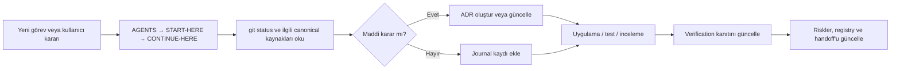

# Project Knowledge Vault — Tasarım Spesifikasyonu

**Tarih:** 2026-07-22
**Durum:** Yazılı kullanıcı incelemesi bekliyor
**Kapsam:** Repo içi karar hafızası, Obsidian-okunabilir proje günlüğü ve release kanıtları
**Seçilen yaklaşım:** Git-sürümlü Markdown vault; Obsidian yalnızca aynı dosyaları okuyan arayüzdür.

## 1. Yönetici özeti

Earnica/Referral deposunda ürün, tasarım, güvenlik, payout ve operasyon kararları
birden çok belgeye yayılmıştır. `CONTINUE-HERE.md` aktif branch handoff'u için
yararlıdır; `docs/DECISIONS.md` kalıcı kararları toplar; spec, plan ve audit
dosyaları ise geniş bir geçmiş taşır. Ancak yeni bir Codex veya ekip üyesi için
tek başlangıç noktası, belge önceliği ve doğrulama kanıtı indeksi yoktur.

Karar: ayrı bir Obsidian kopyası veya senkronizasyon eklentisi kurmak yerine,
deponun Git ile sürümlenen `docs/knowledge/` alanı proje hafızası olacaktır.
Obsidian vault kökü depo köküdür; böylece `START-HERE.md`, handoff ve bağlı
spec/plan dosyaları aynı vault içinde kalır. `docs/knowledge/` bu vault'un
zorunlu giriş ve yönetim alanıdır. Kişisel Obsidian pencere/yerleşim durumu
Git'e girmez ve `.obsidian/` altında yerel kalır. Böylece clone edilen her
makine aynı hafızayı taşır ve iki ayrı kaynak arasında drift oluşmaz.

Bu tasarım iki iş akışını net biçimde ayırır:

1. Kalıcı karar, görsel referans, risk ve kanıt hafızasını kurmak.
2. Mevcut payout dispatch checkpoint test/release işini bu hafıza düzenine
   bağlı biçimde tamamlamak.

Bu belge hafıza altyapısını tanımlar; payout lifecycle veya ürün davranışını
değiştirmez.

## 2. Hedefler ve hedef dışı alanlar

### 2.1 Hedefler

- Yeni bir insan veya Codex oturumu, clone sonrası zorunlu okuma sırasını tek
  bir dosyadan öğrenir.
- Maddi ürün, teknik, güvenlik, gizlilik, tasarım, release ve deployment
  kararlarının gerekçesi, alternatifi, etkisi ve güncel durumu bulunur.
- Onaylı tasarım yönleri ve Git'te bulunan render/reference dosyaları,
  kaynakları ve uygulanma durumu ile görünür olur.
- Test, build, browser QA, review ve deploy iddiaları tarihli kanıta bağlanır;
  doğrulanmamış durumlar açıkça `Not verified` kalır.
- Eski belgeler korunur; yanlışlıkla yeniden yazılmak yerine canonical,
  active, historical veya superseded durumları registry'de görünür olur.
- Hiçbir secret, token, parola, SSH anahtarı, bağlantı dizesi veya müşteri PII'ı
  hafıza kayıtlarına girmez.

### 2.2 Hedef dışı alanlar

- Uygulama çalışırken kararları otomatik algılayıp Obsidian'a yazmak.
- Ayrı bir cloud vault, çift yönlü senkronizasyon veya Obsidian eklentisi
  kurmak.
- Geçmiş sohbetlerdeki fakat Git/doküman kanıtı olmayan tüm kararları kesin
  doğruymuş gibi yeniden üretmek.
- Var olan spec, plan veya audit dosyalarını topluca taşımak ya da silmek.
- Bu hafıza çalışması sırasında payout, auth veya tree davranışını değiştirmek.

## 3. Seçenekler ve karar

| Seçenek | Artı | Risk | Sonuç |
| --- | --- | --- | --- |
| Tek büyüyen `DECISIONS.md` | En düşük başlangıç maliyeti | Aranabilirlik, sahiplik ve güncellik hızla bozulur | Reddedildi |
| Repo içi Markdown vault | Clone ile gelir, Git review/rollback vardır, tek kaynak oluşur | Yazım disiplini gerekir | **Seçildi** |
| Ayrı Obsidian vault + sync | Kişisel dashboard esnekliği | Kopya/drift, erişim ve backup karmaşıklığı | Reddedildi |

## 4. Bilgi mimarisi

```text
AGENTS.md
  → docs/knowledge/START-HERE.md
  → CONTINUE-HERE.md

docs/knowledge/
  START-HERE.md
  CURRENT-STATE.md
  registry.md
  visual-references.md
  risks-and-open-items.md
  decisions/
    ADR-YYYYMMDD-short-slug.md
  journal/
    YYYY-MM.md
  verification/
    current-release.md
```

### 4.1 `START-HERE.md`

Yeni Codex/insan için zorunlu giriş belgesidir. Aşağıdakileri içerir:

- Bu vault'un amacı ve secret/PII güvenlik kuralı.
- Okuma sırası: root `AGENTS.md` → bu dosya (oryantasyon) →
  `CONTINUE-HERE.md` dosyasının tamamı → `git status --short` →
  `CURRENT-STATE.md` → registry'deki canonical kaynaklar → ilgili ADR/spec/plan
  → `verification/current-release.md`.
- İşe başlamadan önce ve handoff sırasında güncellenmesi gereken kayıtlar.
- Kullanıcıdan gelen yeni maddi kararların koddan önce ADR'ye kaydedilmesi
  kuralı.

Root `AGENTS.md`, bu dosyayı ilk zorunlu oryantasyon adımı olarak işaretler;
ancak mevcut kuralı zayıflatmaz: herhangi bir değişiklikten önce aktif branch
güvenlik kuralları için `CONTINUE-HERE.md` **tamamı** okunur ve çalışma ağacı
kontrol edilir. `START-HERE.md` handoff'un yerine geçmez.

### 4.2 `CURRENT-STATE.md`

Bu dosya kısa bir yönlendirme panosudur; uzun test sonucu veya kararı kopyalamaz.

- Aktif çalışma alanı, branch/PR bağlantısı, son gözden geçirme tarihi.
- Mevcut faz ve doğrudan authoritative kaynaklara bağlantılar.
- Canlı/deployment doğrulama durumu.
- Bir sonraki güvenli başlangıç eylemi.

Detaylı branch release durumu `CONTINUE-HERE.md`, test kanıtı
`verification/current-release.md` ve kalıcı karar ADR'de tutulur. Böylece aynı
bilgi üç kez kaynak-of-truth olarak yazılmaz.

### 4.3 `registry.md`

Mevcut ve yeni önemli dokümanlar için şu alanları tutar:

| Alan | Açıklama |
| --- | --- |
| Belge | Repo-relative yol |
| Amaç | Belgenin tek cümlelik rolü |
| Durum | `canonical`, `active`, `historical`, `superseded` veya `needs-reconciliation` |
| Öncelik | Çakışmada hangi kaynak önce okunur |
| Sonraki işlem | Link düzeltme, ADR ile supersede etme veya doğrulama |

Registry, eski belgeyi sessizce değiştirmek yerine çelişkiyi görünür kılar.

### 4.4 `decisions/ADR-*.md`

Bir ADR yalnızca maddi kararlar için oluşturulur: ürün davranışı, para akışı,
güvenlik/RBAC, veri modeli, gizlilik, mimari, UI davranışı, release/deploy veya
kapsam değişikliği.

Zorunlu şablon alanları:

```markdown
# ADR-YYYYMMDD — Başlık

- Tarih:
- Durum: proposed | accepted | superseded | retired
- Karar sahibi:
- Etkilenen alanlar:
- Supersedes / Superseded by:

## Bağlam
## Karar
## Alternatifler ve neden seçilmedikleri
## Sonuçlar / riskler
## Uygulama ve doğrulama bağlantıları
## İlgili render, spec, plan ve handoff
```

Her ADR, bilinen doğrulama seviyesini belirtir. Bir UX kararı görsel olarak
onaylanmış olabilir; bu, production implementation veya browser QA'nın geçtiği
anlamına gelmez.

### 4.5 `journal/YYYY-MM.md`

Journal append-only çalışma günlüğüdür. Rutin ilerleme, keşif, alınan kullanıcı
geri bildirimi, denemeler, doğrulama başlangıcı/sonucu ve handoff olaylarını
kısa biçimde taşır. Maddi kararın tamamı journal'a kopyalanmaz; ilgili ADR'ye
bağlantı verilir.

Her kayıt şu minimum alanları içerir: tarih/saat, bağlam, yapılan iş, karar veya
sonuç, kanıt/bağlantı ve sonraki güvenli adım.

### 4.6 `verification/current-release.md`

Release, test, build, review ve deployment kanıtının tek güncel özeti olur.
Her satırda komut veya kontrol, çalıştırma tarihi, kapsam, sonuç, kanıt bağlantısı
ve durum (`passed`, `failed`, `blocked`, `not-run`, `stale`) bulunur.

Bu kayıt asla bir sonucu icat etmez. Örneğin SSH erişimi reddedildiyse production
durumu `blocked`; full integration hiç tamamlanmadıysa `not-run` veya `stale`
kalır.

### 4.7 `risks-and-open-items.md`

Her açık madde için önem derecesi, alan, sahip/bağımlılık, tarih, karar ihtiyacı,
sonraki doğrulanabilir aksiyon ve ilgili kaynak bağlantısı saklanır. Bu dosya
gelecek fikirlerini aktif release blocker gibi göstermemelidir.

### 4.8 `visual-references.md`

Bu dosya özellikle onaylı render ve tasarım referanslarını saklar. Her kayıt:

- referans dosyası veya URL'si;
- tasarım/spec kaynağı;
- karar/onay durumu ve tarihi (kanıt varsa);
- asset provenance'ı (Git-tracked, local-session candidate veya external);
- hangi yüzeye ait olduğu;
- implementation durumu;
- QA/verification durumu;
- supersede veya retention durumu;
- görseldeki örnek verinin gerçek ürün sözleşmesine aykırı olmaması için notlar
  içerir.

Git'te şu an bulunan ilk render kayıtları:

| Referans | Yüzey | Karar durumu | Implementation / QA durumu |
| --- | --- | --- | --- |
| `docs/superpowers/specs/assets/earnica-operations-workspace-reference.png` | Earnica operations workspace | İlgili value-flow planında onaylı görsel yön | Ayrı implementation/QA kanıtı zorunlu |
| `docs/superpowers/specs/assets/referral-tree-admin-focus-cockpit.png` | Admin network hierarchy | 2026-07-20 hierarchy spec'te onaylı `Focus Cockpit` yönü | Handoff ve taze verification kaydı ayrı okunur |
| `docs/superpowers/specs/assets/referral-tree-member-focus-tree.png` | Member network | 2026-07-20 hierarchy spec'te onaylı üye tree yönü | Handoff ve taze verification kaydı ayrı okunur |

`docs/DESIGN-VISION.md`, `docs/DESIGN.md` ve
`docs/design-preview/index.html` da registry/visual index'te tasarım kaynağı
olarak bağlanır.

İlk migration, Git dışında fakat bu çalışma alanında erişilebilir olan geçmiş
render'ları da tek tek `local-session candidate` olarak kaydeder. Her biri için
SHA-256, session/provenance, yüzey, onay kanıtı, Git'e alma veya reddetme kararı
ve retention durumu tutulur. Bilinen candidate kümeleri şunlardır:

- 2026-07-18 referral value-flow (`preview`, `final`, `details`), member shell,
  desktop reference ve üç tree-redesign audit render'ı;
- 2026-07-20 Americana command-center desktop/tablet/production/final render'ları;
- 2026-07-21 current admin mobile ve imports screenshot'ları.

Bu local dosyalar clone-safe değildir ve yalnız dosya adına bakarak “onaylı”
olarak işaretlenmez. Kullanıcının mevcut onayı ve kaynak spec/plan kanıtı olanlar
ayrı yazılır; diğerleri `approval evidence unknown` kalır. İleri bir kararla
Git'e alınacak asset'in kopyası repo-relative bir yola taşınır ve hash'i
değişmeden visual index'e bağlanır.

## 5. Authoritative kaynak ve çakışma kuralları

Kaynaklar tek bir “her durumda üstün” sıra değildir. Her biri farklı soruya
cevap verir; çelişki fark edildiğinde sessizce birini ezmek yerine reconciliation
kaydı açılır.

### 5.1 Güvenlik ve çalışma sınırları

`AGENTS.md`, aktif `CONTINUE-HERE.md` ve güvenli çalışma kuralları, hangi
işlemlerin yapılabileceğini belirler. Güncel kullanıcı ürünü yönlendirebilir,
ancak güvenlik, secret koruması veya doğrulama sınırını sessizce kaldırmaz.
Gerçek bir çelişki açıkça belgelenir ve kullanıcıyla netleştirilmeden uygulanmaz.

### 5.2 Ürün ve tasarım niyeti

Güncel, açık kullanıcı ürünü kararı önce ADR'ye kaydedilir; kabul edilmiş ADR
veya açıkça kabul edilmiş tasarım spec'i hedef davranışı tanımlar.
`docs/DECISIONS.md`, ilgili ADR ile supersede edilene kadar mevcut kalıcı karar
kaynağıdır. Eski spec/plan ve preview'ler yalnız registry'deki statülerine göre
yorumlanır.

### 5.3 Gerçek uygulama ve kanıt

Runtime code, taze testler ve deployment kanıtı sistemin **fiilen ne yaptığını**
gösterir; onaylı ürün kararını tek başına değiştirmez. Beklenen davranışla
çelişiyorsa registry/risk kaydı açılır, ADR/handoff güncellenir ve normal review
ile çözülür. Taze verification, `passed`/`live` gibi iddiaların tek kanıtıdır.

### 5.4 Tarihsel kayıtlar

Audit, eski plan, eski preview ve erişilemeyen eski sohbet artefact'ları
tarihsel bağlam sağlar; canonical davranış veya release sonucu iddia etmez.

Registry bu eksenlerdeki kaynakları indeksler; kendi başına ürün davranışını
tanımlamaz.

İlk migration'da aşağıdaki bilinen çelişkiler açıkça kaydedilir:

- Referral hierarchy spec'i uygulama başlamamış/review bekliyor derken aktif
  handoff tree işini tamamlanmış sayar.
- Payout authority evidence eski iki aşamalı durumu tanımlarken handoff yeni
  `processing → dispatched → settled` checkpoint'ini tanımlar.
- Eski build plan KYC/OFAC'ı kapsam dışı gösterirken aktif handoff
  fraud/KYC/sanctions kontrollerini release güvenlik akışına dahil eder.
- README/audit, artık repoda bulunmayan `AI/` klasörüne referans verir.

Bu çelişkiler ilk geçişte kaybolmaz; `needs-reconciliation` olur ve ilgili ADR
veya handoff ile çözülene kadar visible kalır.

## 6. Çalışma akışı



### 6.1 Başlangıç

Codex önce root `AGENTS.md` ile `START-HERE.md`'ye ulaşır; sonra aktif
`CONTINUE-HERE.md` dosyasını tamamen okur ve `git status --short` çalıştırır.
Ardından yapılacak işin etkilediği ADR/spec/plan ve son verification durumunu
kontrol eder. Açık risk veya blokaj varsa ilk plan buna göre sınırlanır.

### 6.2 Karar anı

Kullanıcı veya ekip maddi bir yön seçtiğinde, implementation başlamadan önce
ADR oluşturulur ya da ilgili ADR güncellenir. Belirsiz fikirler karar gibi
işaretlenmez; risk/open-item olarak kaydedilir.

### 6.3 Doğrulama ve handoff

Bir test, build, browser QA, code review veya deploy denemesi bittiğinde sonuç
verification kaydına gider. İş kesilirse aynı oturumda journal, açık riskler ve
`CONTINUE-HERE.md` güncellenir. `CURRENT-STATE.md` yalnız link/özet seviyesinde
güncellenir; ayrıntı kopyalanmaz.

### 6.4 Güvenlik ve hata davranışı

- Secret/PII şüphesi varsa bilgi kayda yazılmaz; sadece güvenli, redakte edilmiş
  olay özeti ve takip aksiyonu tutulur.
- Kaynaklar çelişirse daha eski belgeyi sessizce doğru kabul etmek yerine
  registry'ye reconciliation kaydı açılır.
- Dış erişim veya deploy doğrulanmadıysa `blocked`/`not verified` yazılır;
  başarılı varsayılmaz.
- Kod, test veya deployment değişikliği sadece dokümantasyon kararından
  türetilmez; normal review ve verification kapılarından geçer.

## 7. Uygulama kapsamı

### 7.1 Oluşturulacak ilk kayıtlar

1. `docs/knowledge/START-HERE.md`
2. `docs/knowledge/CURRENT-STATE.md`
3. `docs/knowledge/registry.md`
4. `docs/knowledge/visual-references.md`
5. `docs/knowledge/risks-and-open-items.md`
6. `docs/knowledge/decisions/ADR-20260722-project-knowledge-vault.md`
7. Mevcut member tree privacy, referral value-flow, Earnica operations workspace
   ve payout dispatch checkpoint için bağlantılı migration ADR/registry kayıtları.
8. Yerel geçmiş render'lar için hash/provenance/onay/retention alanlarını taşıyan
   visual ingestion kayıtları.
9. `docs/knowledge/journal/2026-07.md`
10. `docs/knowledge/verification/current-release.md`
11. Root `AGENTS.md` güncellemesi ve hafif dokümantasyon doğrulama komutu.

### 7.2 Dokümantasyon doğrulama komutu

Hafif bir Node tabanlı kontrol aşağıdaki sınırlarla eklenecektir:

- zorunlu vault dosyalarının varlığı;
- `START-HERE.md` içindeki zorunlu linklerin çözülmesi;
- ADR dosyalarında zorunlu başlık/metadata alanlarının bulunması;
- registry satırlarında geçerli durum etiketi;
- bilinen secret/connection-string biçimlerine karşı sınırlı redaction guard;
- sahte “passed/live” iddialarını tespit etmeye çalışmamak; bu insan/review
  doğrulamasının yerini tutmaz.

Bu kontrol sadece doküman yapısını ve temel hijyeni doğrular; production veya
uygulama doğrulaması değildir.

## 8. Kabul kriterleri

- Fresh clone'da `AGENTS.md`, ilk adım olarak `START-HERE.md`'yi işaretler.
- Vault'taki her ilk kayıt Git tarafından takip edilir ve Markdown linkleri
  çalışır.
- Her ADR şablonu tarih, durum, karar, alternatif, sonuç ve bağlantı alanlarını
  taşır.
- Onaylı mevcut render'lar, kaynakları, karar durumu, asset provenance'ı ve
  doğru implementation/QA durumu ile visual index'te görünür.
- Git dışındaki her bilinen render candidate'i hash/provenance ve açık
  Git'e-alma/retention kararıyla kayıtlıdır; kanıt yoksa onaylı yazılmaz.
- Bilinen doküman driftleri registry'de açıkça listelenir ve hiçbir test/deploy
  sonucu doğrulanmış gibi yazılmaz.
- Secret/PII guard ve yapısal kontrol başarıyla çalışır.
- Aktif payout dispatch test matrisi, production SSH blokajı ve ilgili
  verification durumları doğru şekilde görünür.
- Uygulama değişikliği yapılmadan önce bu dokümantasyon değişikliği bağımsız
  olarak gözden geçirilir ve commit edilir.

## 9. Test ve inceleme planı

1. Markdown yollarını ve zorunlu dosyaları kontrol eden dokümantasyon komutunu
   çalıştır.
2. `git diff --check` çalıştır.
3. Yeni okuma sırasını fresh-clone senaryosu olarak manuel gözden geçir.
4. Registry/ADR/verification bağlantılarının bütünlüğünü bağımsız review ile
   denetle.
5. Çalışma ağacını kontrol et; yalnız kapsam içi doküman değişikliklerini commit
   et.

## 10. Sonraki aşama

Bu spesifikasyon kullanıcı tarafından yazılı olarak incelendikten sonra ayrıntılı
uygulama planı hazırlanacaktır. Plan onayından sonra vault kurulacak; ardından
aktif payout release-hardening işi aynı kayıt düzeniyle devam edecektir.
